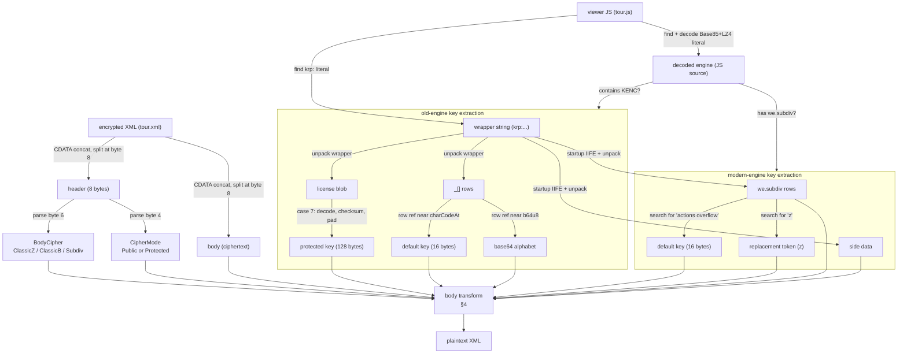

# krpano Encrypted Tour XML — Format Notes

Reverse-engineered from fixtures and engine source analysis.

---

## 1. The two input files

An encrypted krpano tour consists of two files that appear together on the page:

| File | Role |
|------|------|
| Encrypted XML, commonly `tour.xml` | A `<krpano>` document containing an `<encrypted>` element with the ciphertext. |
| Viewer JS, commonly `tour.js` or `krpano.js` | The krpano player. The decoded engine source (never executed) holds the keys. |

The XML specifies the **transform**; the JS provides the **key**.

---

## 2. The encrypted XML

### 2.1. XML structure

```xml
<krpano>
  <encrypted><![CDATA[KENC....abc...]]><![CDATA[def...]]></encrypted>
</krpano>
```

The `<encrypted>` element's text content may split across multiple CDATA sections (and may include non-CDATA text nodes). All text content is concatenated into a single string — without trimming or normalizing beyond standard XML parsing — to form the encrypted payload.

The payload consists of an 8-byte ASCII **header** followed by a **body**. A payload shorter than 8 bytes, or not starting with `KENC`, is treated as unencrypted XML.

### 2.2. The KENC header

The first 8 bytes begin with `KENC`. The remaining four bytes are:

| Offset | 0 | 1 | 2 | 3 | 4 | 5 | 6 | 7 |
|--------|---|---|---|---|---|---|---|---|
| Byte   | K | E | N | C | mode | U | cipher | R |

Bytes 5 and 7 are `U` and `R` in every observed fixture. Their purpose is not yet determined; they do not affect the cipher/mode dispatch.

The two meaningful fields are decoded with arithmetic relative to the constant **80** (derived in the engine as `k = (r<<4)+(r<<2)` with `r=4`):

**Cipher mode** (byte 4) — whether a license-derived key is needed:

| Char | `(charCode - 80) >> 1` | Meaning |
|------|------------------------|---------|
| `P` | 0 | **Public** — no license key |
| `R` | 1 | **Protected** — license key required |

`U` (`charcode('U') = 85`, result `2`) also appears in old-engine switch cases, but no observed fixture has `U` in byte 4.

**Body cipher** (byte 6) — which pipeline decrypts the body:

| Char | `charCode - 80` | Pipeline |
|------|-----------------|----------|
| `Z` | 10 | **ClassicZ** — Modified Base85 → RC4 → LZ4 → UTF-8 |
| `B` | -14 | **ClassicB** — Custom Base64 → RC4 → UTF-8 |
| `P` | 0 | **Subdiv** — Token replacement → `we.subdiv` branch 5 |
| `R` | 2 | **Subdiv** — Same pipeline; public vs protected is encoded inside the body |

The header fields parse independently, following the grammar:

```text
KENC <mode> U <cipher> R
mode   := P | R
cipher := Z | B | P | R
```

Observed combinations:

| Header | Cipher | Mode | Observed engine |
|--------|--------|------|----------------|
| `KENCPUZR` | ClassicZ | Public | modern |
| `KENCRUZR` | ClassicZ | Protected | old |
| `KENCPUBR` | ClassicB | Public | old |
| `KENCPUPR` | Subdiv | Public | modern (<=1.21) |
| `KENCRURR` | Subdiv | Protected | modern (<=1.21) |

Combinations not listed (e.g. `KENCRUBR`) either have not been observed or are unsupported — see §6.

---

## 3. The viewer JS

### 3.1. Two layers of packing

The viewer JS file contains a long string literal that decodes in two stages:

1. **Modified Base85** — groups of 5 characters decode to a 32-bit integer. Big-endian in pre-1.24 engines, little-endian in 1.24. The correct endianness is determined by validating the resulting LZ4 header.
2. **LZ4 block** — the decoded bytes form an LZ4-compressed block with an 8-byte header: 3-byte LE decompressed length at offset 0, 3-byte LE compressed length at offset 4. Bytes 3 and 7 appear unused in observed fixtures. This is a krpano-specific header, not a standard LZ4 frame.

The decompressed result is the **decoded engine** — the raw krpano JavaScript source. Keys are extracted by static analysis of this source; it is never executed.

The same file also contains a second string literal: the **wrapper string**, starting with `krp:`. In the page HTML this string is the argument to `embedpano`. It is a payload from which keys are derived; it is not itself a key.

### 3.2. Engine families

The decoded engine belongs to one of two families, distinguished by how it stores decryption constants:

**Old engines** (observed 2013–2017) — the source contains the literal substring `KENC`. Constants live in a numeric `_[]` string table.

**Modern engines** (observed 2018+) — the source does NOT contain literal `KENC`. Constants are reconstructed from the `we.subdiv` closure, populated at startup by a key-unpack IIFE.

### 3.3. Old engine key extraction

The wrapper `krp:` string is an obfuscated payload. Unpacking it (reverse-substitution cipher with a per-fixture salt and rolling checksum) yields two data structures:

- **`_[]` rows** — a table of pipe-delimited string records.
- **License blob** — a Base64-encoded string interleaved between the rows.

**Protected key.** In observed fixtures, one `_[]` row contains license field tags (e.g. `xx=lz=rg=ma=...=ek=...`). A tag ending with `=` (typically `ek=`) names a field within the license blob. The engine's `pc.init` function processes this field in the `case 7` arm of a switch statement: it Base64-decodes the value, validates a `ck=` checksum, maps each resulting byte through `charCodeAt(i) & 255`, and zero-pads the result to 128 bytes. This 128-byte string is the protected key.

**Default key and Base64 alphabet.** The ClassicB cipher requires a default key and a custom Base64 alphabet. Both are `_[]` rows referenced near the `String(e).charCodeAt` and `b64u8` helpers in the decoded engine source. The exact extraction mechanism is engine-source proximity: the row whose value is referenced by the helpers.

### 3.4. Modern engine key extraction

Modern engines do not store keys in the source text. Instead, a startup IIFE reconstructs them at startup by unpacking the wrapper string:

1. Compute a checksum of the wrapper string. The checksum constant varies by engine subfamily (observed values: 22248, 22557, 23293). The IIFE is found structurally by identifying `(function …){…}` blocks that contain numeric literals.
2. Build a shuffle array from the engine's browser-name table (`Ma`, where `Ma[1]` is observed as `"Android Browser"`).
3. Unpack the wrapper string into `we.subdiv` rows and **side data** — semicolon-separated key=value records (Base64-decoded then decoded as krpano-modified UTF-8).

After unpacking, calls like `_("<id>")` read rows from the `we.subdiv` closure. All rows are searched **by value**:

| Searched value | Becomes |
|---------------|---------|
| `"actions overflow"` | Default key (16 bytes, used by ClassicZ in Public mode) |
| `"z"` | Replacement token (used by Subdiv cipher) |

In all observed modern engines, the default key resolves to `"actions overflow"` and the replacement token to `"z"`, even though the row IDs differ across versions.

### 3.5. Pipeline overview

With all concepts defined, here is the full decryption pipeline. Rectangles are data; arrow labels are the algorithms that produce or consume them.



The dispatch node represents the three body ciphers: ClassicZ (Base85 → RC4 → LZ4 → UTF-8), ClassicB (Base64 → RC4 → UTF-8), and Subdiv (token replace → `we.subdiv` branch 5). Each is described in §4.

---

## 4. The body ciphers

With the header (cipher + mode) and the key, the body can be decrypted.

### 4.1. Shared building block: the RC4-like byte decryptor

The ClassicZ and ClassicB ciphers both use a modified RC4. It operates in four phases:

**Phase 1 — Key mixing.** The first 128 bytes of ciphertext are interleaved with key bytes to initialize the first half of a 256-entry state array. The second half (entries 128–255) is initialized to sequential values:

```text
for i = 0; i < 128; i++:
    state[i] = (key[i & key_mask] ^ ciphertext[i]) & 255
for i = 128; i < 256; i++:
    state[i] = i
```

**Phase 2 — KSA.** The full 256-byte state is shuffled:

```text
j = 0
for i = 0; i < 256; i++:
    j = (j + state[i] + key[i & key_mask]) & 255
    swap(state[i], state[j])
```

**Phase 3 — Discard.** The first 256 bytes of the PRGA keystream are generated and thrown away (i and j carry forward from KSA).

**Phase 4 — Decrypt.** Starting from offset `encrypted_start = 128 + (ciphertext[65] & 7)`, each remaining ciphertext byte is XORed with the keystream. Bytes before `encrypted_start` are key-mix material and are not emitted as output.

The `key_mask` is 15 for the default 16-byte key. The engine widens it via `f |= f << 3`, giving 127. When a key index exceeds the key string, JavaScript's `charCodeAt` returns `NaN`, which is coerced to 0 by the bitwise operations used in the KSA.

The index 65 used in `encrypted_start` appears in engine source as `Ma[1]`, not as a literal constant. The mask for the `ciphertext[65] & 7` computation is always 15 in observed engine source, regardless of the key mask.

### 4.2. ClassicZ

Pipeline: **Modified Base85 → RC4 decrypt → LZ4 decompress → UTF-8**.

The body is modified-Base85 text. Decoding yields raw bytes. After RC4 decryption (using the key-mix prefix and discarding bytes before `encrypted_start`), the emitted decrypted payload is an LZ4-compressed block with an 8-byte header (same format as the packed viewer). After LZ4 decompression, the result is UTF-8 XML.

| Mode | Key used |
|------|---------|
| Public (observed only with modern engines) | Modern engine's default key (`"actions overflow"`, 16 bytes, mask 15) |
| Protected (observed only with old engines) | Old engine's protected key (128 bytes, widened mask 127) |

Proven vector (2018-04-04 fixture, Public): 9,915-char body → 7,932 bytes Base85 → 7,803 emitted decrypted bytes after dropping key-mix prefix → 36,407 bytes plaintext XML.

### 4.3. ClassicB

Pipeline: **Custom Base64 → RC4 decrypt → UTF-8**.

The Base64 alphabet is extracted from the old engine's `_[]` table (the row referenced near the `b64u8` helper in the decoded engine source). It is not standard RFC 4648 Base64 unless the extracted alphabet happens to match. The RC4 key is the old engine's default key (the row referenced near `String(e).charCodeAt`).

Only observed in Public mode, with old engines. Fixtures: `2013-06-05-B`, `2013-08-09-B`.

### 4.4. Subdiv (2023/2024 path)

This cipher does **not** use RC4. Instead:

1. Replace every occurrence of the replacement token (`"z"`) with the byte `0x5C` (backslash). The token is extracted from a `we.subdiv` row whose value is `"z"`. In the Subdiv body encoding, `"z"` serves as an escape marker and does not appear literally.
2. The first two bytes after replacement form a mode prefix: `%*` for public, `&*` for protected. This prefix is expected to be consistent with the header byte 4.
3. Locate the `we.subdiv` row whose value is `"krpano"` (searching all unpacked rows by value).
4. Decompress using `we.subdiv` branch 5. The row's 6th character (JS `charCodeAt(5)`) divided by 3 gives a parameter `g` (e.g. `111 / 3 = 37` for `"krpano"`). The decompressor is krpano-specific: skip leading zero bytes, skip a BOM (byte sequence `EF BB BF`), then decode up to 3-byte UTF-8 sequences with a JavaScript-semantic length-extension loop. All arithmetic uses signed 32-bit wrapping. **The full algorithm is not yet documented in detail.**
5. In protected mode, branch 5 reads the side data (Base64-decoded, krpano-UTF-8-decoded, semicolon-separated key=value records) and extracts the `pk=` entry, which serves as a validation/access token consumed by the decompressor.

### 4.5. Subdiv (1.24 path — not yet decoded)

In krpano 1.24, Subdiv bodies use different inner prefixes from the 2023/2024 path:
- Public: `%*...` (same prefix bytes, different payload structure after the prefix)
- Protected: `$*<key-id>@...` (vs `&*` in 2023/2024)

**Confirmed prefix/payload facts (2026-06-27 instrumentation):**

| Fixture | Mode | Prefix | Key ID | Raw B85 len | Decoded bytes | Plaintext len |
|---------|------|--------|--------|-------------|---------------|---------------|
| pp-01_minimal | Public | `%*` | — | 144 | 112 | 44 |
| pp-02_special_chars | Public | `%*` | — | 399 | 316 | 279 |
| pp-03_nested | Public | `%*` | — | 774 | 616 | 862 |
| pp-04_large | Public | `%*` | — | 919 | 732 | 3895 |
| pp-05_deep | Public | `%*` | — | 294 | 232 | 250 |
| rr_minimal | Protected | `$*` | `PFIXTURE_rr_minimal` | 163 | 128 | 63 |
| rr_special | Protected | `$*` | `PFIXTURE_rr_special...` (85 chars total) | 322 | 256 | 264 |
| rr_tour | Protected | `$*` | `MFIXTURE_rr_tour...` (85 chars total) | 466 | 372 | 431 |

**Key findings:**

1. The inner payload decodes as modified Base85 (5-to-4, big-endian, same alphabet as ClassicZ).
2. **The decoded payload is too short for ClassicZ RC4** — the RC4 key-mix requires >=128 bytes of prefix. PP minimal decodes to 112 bytes; RR minimal at 128 bytes is exactly at the boundary but RC4 still fails with `InvalidByteCipherInput` because `encrypted_start` (128 + input[65]&7) exceeds the decoded length.
3. Both BE and LE endianness were tried, as well as widened and narrow RC4 key modes — all combinations fail.
4. This confirms a **different decompression scheme** from both ClassicZ (Base85->RC4->LZ4) and Subdiv branch 5 (custom decompressor using `g` parameter from "krpano" row).

**Engine context for 2026 engines:**
- Engine context extraction succeeds: 136 unpacked rows, checksum constant 23293 (same as 2023-2024).
- The `pk=` protection key IS present in side data for RR fixtures (128 chars, same format as 2023/2024).
- The "krpano" row exists and yields `g=37` (111/3).
- The replacement token is `"z"` (same as 2023/2024).

**Why branch 5 cannot handle 1.24 bodies:**
- The first two bytes of the 1.24 body after `z->\\` replacement are `%*` (37, 42) for PP and `$*` (36, 42) for RR.
- For branch 5 these would be bytes `d[0]` and `d[1]`; with `g=37`: PP gives `f=0, h=5` (public) and RR gives `f=-1, h=5` (invalid — `f` must be 0 or 1).
- Since RR gives `f=-1`, the 1.24 engine MUST use a different branch than branch 5 for RR bodies.

**Next steps to trace:**
- The 1.24 engine's `F` function likely calls a DIFFERENT `we.subdiv` branch (not branch 5) when the body prefix is `%*` or `$*`.
- This new branch needs to be traced from the decoded engine source.
- The decoded Base85 payload might feed into a compression-only scheme (no encryption), or a dictionary/keyed transform using the `$*<key-id>` for key selection.

---

## 5. File discovery and decryption flow

Encrypted tours are typically discovered by navigating a page. The two files (XML and JS) may arrive in any order:

| Content received | Typical handling |
|-----------------|------------------|
| HTML page | Extract `<script src="...">` tags. Scripts whose URL resembles `tour.js` or `krpano.js` are tried first. The XML path may be inferred from `embedpano` parameters. |
| Viewer JS | Infer the XML URL by changing the file extension (e.g. `.js` → `.xml`). If the JS was reached via HTML, `embedpano` parameters may specify the XML directly. |
| Encrypted XML | Store the XML URI (needed for relative tile paths). Locate the viewer JS — inferred from the XML URL, or via candidate URLs from the original HTML page. |
| Plain XML | No decryption needed; parse tour metadata directly. |

If a JS candidate fails to decrypt (e.g. an analytics script that coincidentally contains base85-like literals), the next candidate is tried. Decryption failures are classified: format-level rejections (e.g. unsupported header) differ from key-mismatch failures (wrong JS candidate).

---

## 6. Unsupported and unobserved variants

| Variant | Status | Notes |
|---------|--------|-------|
| 1.24 Subdiv, both modes | Not decoded | Prefixes parsed (`%*` / `$*<key-id>@`). Base85 decode succeeds but payload is too short for RC4 (112 bytes PP, 128 bytes RR). Branch 5 rejects RR (`f=-1`). Different branch/transform needed. Engine context extraction works (136 rows, checksum=23293). pk= present in RR side data (128 chars). |
| `G` mode (old engine byte-4) | No fixture | Appears in `2015-08-04` engine source switch cases. No observed tour uses it. |
| ClassicB Protected (`KENCRUBR`) | No fixture | Parsable header combination, but never observed. If it exists, it would likely use the old engine's protected key. |
| Cross-family combinations (e.g. ClassicZ Protected with modern engine) | No fixture | ClassicZ Protected has only been observed with old engines; Public only with modern engines. Other combinations are theoretically possible but unobserved. |

---

## 7. Fixture corpus

All fixtures under `testdata/krpano/encrypted/`. Each directory contains `tour.xml` and `tour.js`.

| Fixture | Header | Cipher | Mode | Engine | Decrypted? |
|---------|--------|--------|------|--------|------------|
| `old` | `KENCRUZR` | ClassicZ | Protected | old | Yes |
| `2013-06-05-B` | `KENCPUBR` | ClassicB | Public | old (1.16.4) | Yes |
| `2013-08-09-B` | `KENCPUBR` | ClassicB | Public | old (1.0.8.15) | Yes |
| `2015-08-04` | `KENCRUZR` | ClassicZ | Protected | old | Yes |
| `2017-09-21` | `KENCRUZR` | ClassicZ | Protected | old | Yes |
| `2018-04-04` | `KENCPUZR` | ClassicZ | Public | modern | Yes |
| `2023-02-07` | `KENCRURR` | Subdiv | Protected | modern | Yes |
| `2023-04-30` | `KENCRURR` | Subdiv | Protected | modern (1.21) | Yes |
| `2023-04-30-PP` | `KENCPUPR` | Subdiv | Public | modern (1.21) | Yes |
| `2023-12-11` | `KENCRURR` | Subdiv | Protected | modern | Yes |
| `2024-12-20` | `KENCRURR` | Subdiv | Protected | modern | Yes |
| `2026-06-25-pp-*` (5 fixtures) | `KENCPUPR` | Subdiv | Public | modern (1.24) | No (1.24 path) |
| `2026-06-25-rr-*` (3 fixtures) | `KENCRURR` | Subdiv | Protected | modern (1.24) | No (1.24 path) |

All 2026 fixtures: prefix `%*` for PP, `$*<key-id>@` for RR. RR key IDs: `PFIXTURE_rr_minimal`, `PFIXTURE_rr_special...`, `MFIXTURE_rr_tour...`. Engine context (136 rows, checksum=23293) and pk= side data (128 chars) extracted successfully. Base85 decode succeeds but decoded payload too short for ClassicZ RC4; branch 5 rejects RR bodies.

---

## 8. Code map

```
src/krpano/
├── mod.rs                  # File discovery and decryption orchestration
├── krpano_metadata.rs      # Plain XML deserialization
├── encrypted/
│   ├── mod.rs              # decrypt_xml (main entry point), detect_engine
│   ├── header.rs           # KencHeader, BodyCipher, CipherMode
│   ├── codecs.rs           # Modified Base85, LZ4 decompression
│   ├── crypto.rs           # RC4-like byte decryptor
│   ├── viewer.rs           # Extract wrapper string + decode packed engine
│   ├── old_engine.rs       # Old engine key derivation (unwrap wrapper, license blob)
│   ├── modern_engine.rs    # Modern engine key extraction (startup IIFE, we.subdiv, branch 5)
│   └── branches.rs         # ClassicZ/ClassicB/Subdiv body transforms
└── PLAN.md
```

---

## 9. Analysis constraints

**No JS execution.** Key extraction relies entirely on static analysis of the decoded engine source text. The engine is never evaluated at runtime.

**Value-based row identification.** Row extraction avoids relying on per-build minified identifiers or hardcoded row IDs. It searches by stable semantic values (e.g. `"actions overflow"`, `"z"`, `"krpano"`) observed across engine versions.

**Key-mix prefix.** The RC4-like decryptor uses a 128-byte key-mix prefix derived from the ciphertext itself. Without the correct key, sparse known plaintext has not been sufficient to recover it in the tested fixtures.
