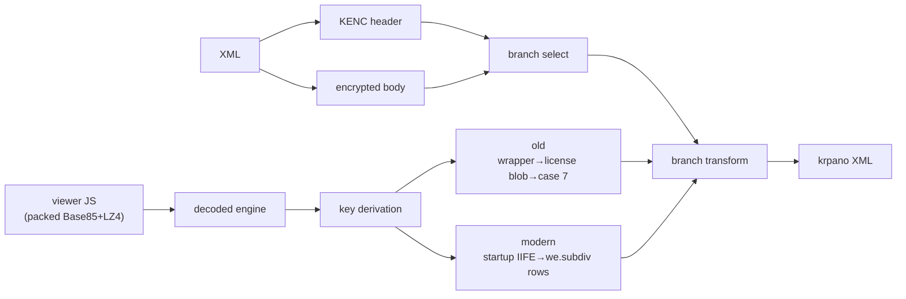

# krpano Encryption Format

This document describes the krpano encrypted-XML format and all its known variants, as reverse-engineered by the dezoomify-rs project. It is both reference documentation and a record of what remains unsupported.

## Table of Contents

1. [Overview](#overview)
2. [Encrypted XML Wrapper](#encrypted-xml-wrapper)
3. [The KENC Header](#the-kenc-header)
4. [Packed Viewer JS](#packed-viewer-js)
5. [The Byte Decryptor](#the-byte-decryptor)
6. [Engine Families](#engine-families)
7. [Branch Transforms](#branch-transforms)
8. [Key Derivation](#key-derivation)
9. [Integration](#integration)
10. [Unsupported Variants](#unsupported-variants)
11. [Fixture Corpus](#fixture-corpus)

## Overview

krpano encrypts tour XML files behind an `<encrypted>` element. Decryption requires two files:

1. **The encrypted XML** — contains a `KENC....` header and an encrypted body.
2. **The viewer JS** (e.g. `tour.js` or `krpano.js`) — itself a packed binary whose decoded engine contains the decryption keys and branch logic.

The header selects a *branch* (Z, B, P/P, R/R) and an *engine family* (old or modern). Each branch defines its own body transform pipeline. Each engine family stores keys differently.



## Encrypted XML Wrapper

Encrypted payloads live inside `<encrypted>` elements. The payload text may be split across multiple CDATA sections:

```xml
<krpano>
  <encrypted><![CDATA[KENC....abc...]]><![CDATA[def...]]></encrypted>
</krpano>
```

**All** CDATA chunks must be concatenated before header parsing. The first eight bytes of the concatenated result are the KENC header.

The plaintext XML (after decryption) is a normal krpano document rooted at `<krpano>`.

## The KENC Header

The header is always 8 bytes, starting with the literal `KENC`:

| Byte | 0 | 1 | 2 | 3 | 4 | 5 | 6 | 7 |
|------|---|---|---|---|---|---|---|---|
| Char | K | E | N | C | mode | enc | key_src | flags |
| Obs. | K | E | N | C | R or U | U | Z/P/R/B | R |

### Field meanings

| Byte | Content | Decoding rule | Observed values |
|------|---------|---------------|-----------------|
| 0–3  | `KENC`  | Literal       | Always `KENC`   |
| 4    | mode    | `(charCode − 80) >> 1` | `R`→1 (protected), `U`→0 (public) |
| 5    | enc     | Direct check  | Always `U` in all fixtures |
| 6    | key_src | `charCode − 80` | See branch table below |
| 7    | flags   | Direct check  | Always `R` in all fixtures |

The constant 80 comes from `k = (r << 4) + (r << 2)` where `r = 4` in modern engines.

### Branch table

| Header      | mode | key_src | Branch | Body transform |
|-------------|------|---------|--------|----------------|
| `KENCRUZR`  | 1    | 10      | Old Z  | Modified Base85 → RC4 → LZ4 → UTF-8 |
| `KENCPUZR`  | 0    | 10      | Modern Z | Same pipeline, modern key |
| `KENCPUBR`  | 0    | −14     | B      | Base64 → RC4 → UTF-8 |
| `KENCRURR`  | 1    | 2       | R/R    | Token replacement → we.subdiv branch 5 |
| `KENCPUPR`  | 0    | 2       | P/P    | Token replacement → we.subdiv branch 5 |

Note: `mode=1` means "protected" (requires a license-derived key). `mode=0` means "public" (no license key needed). In `Z`, this distinguishes Old from Modern; in `P`/`R`, it distinguishes protected `R/R` from public `P/P`.

## Packed Viewer JS

The viewer JS file (`tour.js`, `krpano.js`, etc.) is a two-layer packed binary:

### Layer 1: Modified Base85

The wrapper source is modified Base85 text. Decoding yields 32-bit words.

- **Pre-1.24 (big-endian):** Words are written as `[word>>24, word>>16, word>>8, word]`.
- **1.24 (little-endian):** Words are written as `[word, word>>8, word>>16, word>>24]`.

### Layer 2: LZ4 Block

Immediately after the Base85 payload, the decoded bytes form an LZ4-compressed block with an 8-byte header:

```
offset 0:  decompressed_length (3 bytes, little-endian)
offset 4:  compressed_length   (3 bytes, little-endian)
```

Decompress the following `compressed_length` bytes into `decompressed_length` bytes.

### Result: Decoded Engine JS

The decompressed output is the raw krpano engine JavaScript. It is never executed by dezoomify-rs; we statically extract only the data needed for XML decryption.

The original packed wrapper also carries a `krp:` string literal (inside a long array assigned to `window.krpano` or similar). This is the **wrapper key** — not the XML decryption key itself, but the payload from which keys are derived.

## The Byte Decryptor

All branches except P/P and R/R use a shared RC4-like byte decryptor.

### Algorithm

```
1. Interleave the first 128 bytes of ciphertext with the key:
      for i in 0..128:  state[i] = (key[i & mask] ⊕ ciphertext[i]) & 255

2. KSA (key-scheduling): mix the 256-byte state
      j = 0
      for i in 0..256:
          j = (j + state[i] + key[i & mask]) & 255
          swap(state[i], state[j])

3. PRGA (pseudo-random generation) + decrypt:
      i = 0, j = 0
      for k in encrypted_start..ciphertext.len:
          i = (i + 1) & 255
          j = (j + state[i]) & 255
          swap(state[i], state[j])
          plaintext[k - encrypted_start] = ciphertext[k] ⊕ state[(state[i] + state[j]) & 255]
```

### Key masking

The step-1 key index is `i & mask` where:

- **Default key path:** `mask = 15` (16-byte key).
- **Widened key path:** `mask = 135` (after `f |= f << 3` branches).

When `key.charCodeAt(index & mask)` is out of range (index beyond the key string), JavaScript produces `NaN`, which in the `(j + state + NaN) & 255` expression becomes 0. Rust models this explicitly.

### Encrypted start offset

```
encrypted_start = 128 + (ciphertext[65] & 7)
```

The index `65` is obfuscated through a browser-name array but always resolves to `"Android Browser".charCodeAt(0)`. The `key_mask` used for `encrypted_start` computation is always `15` (the default mask), even when the widened-key path is active. This matches the JS engine order of operations.

### Common prefix

The first 128 ciphertext bytes are never part of the plaintext. They are consumed entirely by the state-initialization phase.

## Engine Families

krpano engines fall into two families distinguished by how they store decryption constants.

### Old Engine Family

**Fixtures:** `old`, `2013-06-05-B`, `2013-08-09-B`, `2015-08-04`, `2017-09-21`

**Characteristics:**
- Decoded engine contains literal `KENC` branch logic.
- Uses a numeric `_[]` string table (e.g. `_[188]`, `_[129]`).
- Does **not** use the modern `decryptData` constant system.
- The wrapper `krp:` key unpacks into `_[]` rows plus a hidden Base64 license blob.
- License blob records are parsed by `pc.init`; the record tagged with the field at row 188 position 21–24 (typically `ek=`) becomes the **protected key** when `case 7` processes it.
- `case 7` Base64-decodes the license value, computes a checksum, looks up characters via `charCodeAt(i) & 255`, and pads the result to 128 characters.

**Key variables across versions:**

| Fixture     | License key variable |
|-------------|---------------------|
| `old`       | `Pd`                |
| `2015-08-04`| `od`                |
| `2017-09-21`| `pe`                |

- `2015-08-04` also has an embedded-key `G` mode (unsupported — no fixture available).
- Old B engines use the **default key** path (from decoded-engine `_[]` references near the byte-helper), not the protected `ek=` key.

### Modern Engine Family

**Fixtures:** `2018-04-04` and newer (including all 2023, 2024, and 1.24 fixtures).

**Characteristics:**
- Decoded engine does **not** contain literal `KENC`.
- Constants are reconstructed from the `we.subdiv` closure, populated by a startup key-unpack IIFE.
- The IIFE evaluates `Rt=_;_=arguments[2]`, rebinding `_` from the `decodeLicense`/`decryptData` wrapper to the `we.subdiv` function.
- After rebinding, `_("<id>")` reads rows from the `we.subdiv` closure.
- The checksum constant varies across engine subfamilies: 22248 (2018), 22557 (2023-02), 23293 (2023-04 and newer).

**we.subdiv row addressing:**

- If `id & 1`: row index = `id >> 7`, branch = `(id >> 2) & 15`
- Otherwise: row index = `(id >> 2) & 255`, branch = `(id >> 11) & 15`
- Branch 0 returns the row as a string.

**Resolved constants across all modern fixtures:**

| Purpose | Resolved value |
|---------|---------------|
| Default byte-helper key | `actions overflow` |
| P/P and R/R replacement token | `z` |

The row IDs vary per fixture (e.g. key ID is `12931` in `2018-04-04`, `5697` in `2023-04-30`, `360` in `2024-12-20`), but the resolved values are always the same. Extraction searches all rows by value, not by hardcoded ID.

## Branch Transforms

### Z Branch (`KENCRUZR` / `KENCPUZR`)

The Z branch pipeline is:

```
body (modified Base85 text)
  → decode_modified_base85 → 32-bit big-endian words
  → decrypt_bytes (RC4, first 128 bytes = key-mix prefix)
  → parse LZ4 block header (8 bytes: decomp_len LE, comp_len LE)
  → lz4_decompress_block
  → UTF-8 decode
  → krpano XML
```

| Variant | Key source |
|---------|-----------|
| Old Z (`mode=1`) | Protected key from wrapper license blob (`ek=`) |
| Modern Z (`mode=0`) | Default key from `we.subdiv` rows (`actions overflow`) |

Old Z uses `widened=true` (the license key is 128 characters). Modern Z uses `widened=false` (16-byte default key).

**Proven vector (2018-04-04):** 9915-char body → 7932 bytes Base85 → 7803 bytes decrypt → 36407 bytes LZ4 → 36407 bytes plaintext.

### B Branch (`KENCPUBR`)

The B branch pipeline is:

```
body (standard Base64 text)
  → base64 decode
  → decrypt_bytes (RC4, with old-engine default key)
  → UTF-8 decode
  → krpano XML
```

B uses the old engine's default key (from the decoded engine's `_[]` table, row referenced near the byte-helper) and a Base64 alphabet also extracted from the decoded engine (used in the `b64u8` helper).

**Fixtures:** `2013-06-05-B` (krpano 1.16.4), `2013-08-09-B` (krpano 1.0.8.15).

### P/P and R/R Branches (`KENCPUPR` / `KENCRURR`)

#### 2023/2024 path (supported)

These use a fundamentally different pipeline from Z/B — there is no RC4 byte decryptor.

1. **Token replacement:** Replace every `z` with `\` in the body.
2. **Header inspection:** After replacement, the first two bytes select the mode:
   - `%*` → P/P (`f=0`, no protection key needed)
   - `&*` → R/R (`f=1`, requires `pk=` protection key)
3. **we.subdiv branch 5:** The XML parser path calls `_("<id>", body, 1)`, dispatching to branch 5 with the row whose value is `"krpano"`.
4. **Decompression:** Branch 5 uses `g = row[5] / 3` (e.g. `g=37` for 2023-04-30) and decompresses the body using krpano's UTF-8 helper semantics (skip zero bytes, skip BOM, decode up to 3-byte UTF-8 sequences).
5. **R/R protection key:** When `f=1`, branch 5 reads side data (semicolon-separated records, Base64-decoded then krpano UTF-8-decoded) and extracts a `pk=` record.

JavaScript length-extension loop: initialize `m = k + n` once, and while `m == A`, consume the next extension byte into `m` and add it to `k`. This must be implemented with JS-semantic wrapping (signed 32-bit integers).

#### 1.24 envelope path (unsupported)

krpano 1.24 P/P and R/R payloads use inner envelopes:
- **P/P:** `%*...` (same prefix as 2023/2024, but the downstream consumer is different)
- **R/R:** `$*<key-id>@...` (embeds a custom key identifier)

The `%*` / `$*...@` envelope prefix is parsed, but the downstream consumer that turns the envelope body into plaintext has not been traced. Known facts:
- After token replacement and envelope stripping, the inner payload decodes as modified Base85.
- The post-Base85 lengths (112–732 bytes for P/P, 128–372 bytes for R/R) are too small for the Z-branch RC4+LZ4 pipeline (minimum 128+ prefix bytes needed).
- The second-level format includes compression or packing, but it is **not** the Z-branch pattern.

## Key Derivation

### Old Engine Key Derivation

**Module:** `old_engine.rs`

```
1. Unpack wrapper krp: key into _[] rows + license blob (Base64).
2. Locate the license record tag: row 188, chars 21–24 (e.g. "ek=").
3. Parse the license blob for the record with that tag.
4. case 7: Base64-decode value, compute checksum, char lookup, pad to 128 chars.
5. Result: protected_key (128 bytes) for Z mode.
6. For B mode: default_key from the decoded-engine _[] reference near the byte-helper.
```

### Modern Engine Key Derivation

**Module:** `modern_engine.rs`

```
1. Scan decoded engine for startup IIFE: (function(…){…}) with checksum body.
2. Compute kenc_payload checksum against the wrapper key.
3. Build lf shuffle from the Ma browser-name array.
4. Unpack krp: wrapper key into we.subdiv rows + side data.
5. Search all rows by value for "actions overflow" → default_key.
6. Search all rows by value for "z" → replacement_token.
```

The extraction is **fully structural** — no hardcoded checksum constants, row IDs, or per-fixture families. It works for any modern engine.

## Integration

The `KrpanoDezoomer` uses a `ResolveState` state machine following the browser load order:

```
HTML → JS → XML → (decrypt if encrypted)
```

**Content-type detection** routes each `DezoomerInput` call:

| Content | Action |
|---------|--------|
| HTML    | Extract `<script>` tags, rank krpano viewer candidates first, return `NeedsData(js_uri)` |
| Viewer JS | Infer XML URL via `sibling_uri`, return `NeedsData(xml_uri)` |
| Encrypted XML | Save pending with original URI, return `NeedsData(js_uri)`. On next call with JS: decrypt, parse with original URI |
| Plain XML | Parse krpano metadata directly |

**Fallback:** If the first viewer JS candidate fails to decrypt, the next `<script>` candidate is tried. This handles sites where analytics scripts appear before the actual viewer.

## Unsupported Variants

| Variant | Status | Blocker |
|---------|--------|---------|
| 1.24 P/P envelope (`%*...`) | ❌ | Downstream consumer of the inner payload not traced |
| 1.24 R/R envelope (`$*<key-id>@...`) | ❌ | Same as above, plus custom-key resolution path unknown |
| `G` mode (old engine, 2015) | ❌ | No fixture available; mentioned in `2015-08-04` engine source |
| Modern widened-key path (`we.subdiv` stateful branches) | ❌ | Not needed by any working fixture path; deferred until a fixture requires it |
| `KENCRUBR` / `KENCXXBZ` / synthetic headers | ❌ | Never observed in the wild |

## Fixture Corpus

All fixtures live under `testdata/krpano/encrypted/`. Each directory contains:
- `tour.xml` — the encrypted XML
- `tour.js` — the packed viewer JavaScript
- `rows.json` — pre-extracted `we.subdiv` rows (for cross-checking, some fixtures only)

| Fixture | Header | Branch | Engine | Status |
|---------|--------|--------|--------|--------|
| `old` | `KENCRUZR` | Old Z | old | ✅ |
| `2013-06-05-B` | `KENCPUBR` | B | old (1.16.4) | ✅ |
| `2013-08-09-B` | `KENCPUBR` | B | old (1.0.8.15) | ✅ |
| `2015-08-04` | `KENCRUZR` | Old Z | old | ✅ |
| `2017-09-21` | `KENCRUZR` | Old Z | old | ✅ |
| `2018-04-04` | `KENCPUZR` | Modern Z | modern | ✅ |
| `2023-02-07` | `KENCRURR` | R/R | modern | ✅ |
| `2023-04-30` | `KENCRURR` | R/R | modern (1.21) | ✅ |
| `2023-04-30-PP` | `KENCPUPR` | P/P | modern (1.21) | ✅ |
| `2023-12-11` | `KENCRURR` | R/R | modern | ✅ |
| `2024-12-20` | `KENCRURR` | R/R | modern | ✅ |
| `2026-06-25-pp-*` (5) | `KENCPUPR` | P/P | modern (1.24) | ❌ |
| `2026-06-25-rr-*` (3) | `KENCRURR` | R/R | modern (1.24) | ❌ |

The 1.24 viewer JS wrappers decode to engine JS, and modern context extraction resolves default keys and replacement tokens. Only the body payload consumer is unresolved.

## Code Structure

```
src/krpano/
├── mod.rs                  # KrpanoDezoomer, ResolveState state machine
├── krpano_metadata.rs      # XML metadata deserialization
├── encrypted/
│   ├── mod.rs              # decrypt_xml, is_encrypted_xml, EncryptedKrpanoError
│   ├── header.rs           # KencHeader, KencBranch, header parsing
│   ├── codecs.rs           # decode_modified_base85, lz4_decompress_block
│   ├── crypto.rs           # decrypt_bytes (RC4-like)
│   ├── viewer.rs           # extract_key_from_viewer_js, extract_decoded_viewer_js
│   ├── old_engine.rs       # Old engine license key derivation
│   ├── modern_engine.rs    # Modern engine static extraction (startup IIFE, we.subdiv)
│   └── branches.rs         # Z branch transform, PP/RR envelope parsing
└── PLAN.md                 # This document
```

## Key Design Decisions

- **Never execute viewer JS in Rust.** All extraction is static (string/structural analysis).
- **No hardcoded minified names.** Extraction uses structure and value-matching, not per-build identifiers like `pa`, `ra`, `la`.
- **Fixture-gated, not name-gated.** Tests select code paths by parsed header values and branch classification, never by fixture directory name.
- **Proven-key first.** Z branch was implemented against `2018-04-04` with the known key `"actions overflow"` before tackling key derivation.
- **No keyless RC4 attacks.** The per-file keystream (variable 128-byte prefix) and sparse known plaintext make this infeasible. Key extraction from viewer JS is the correct path.
