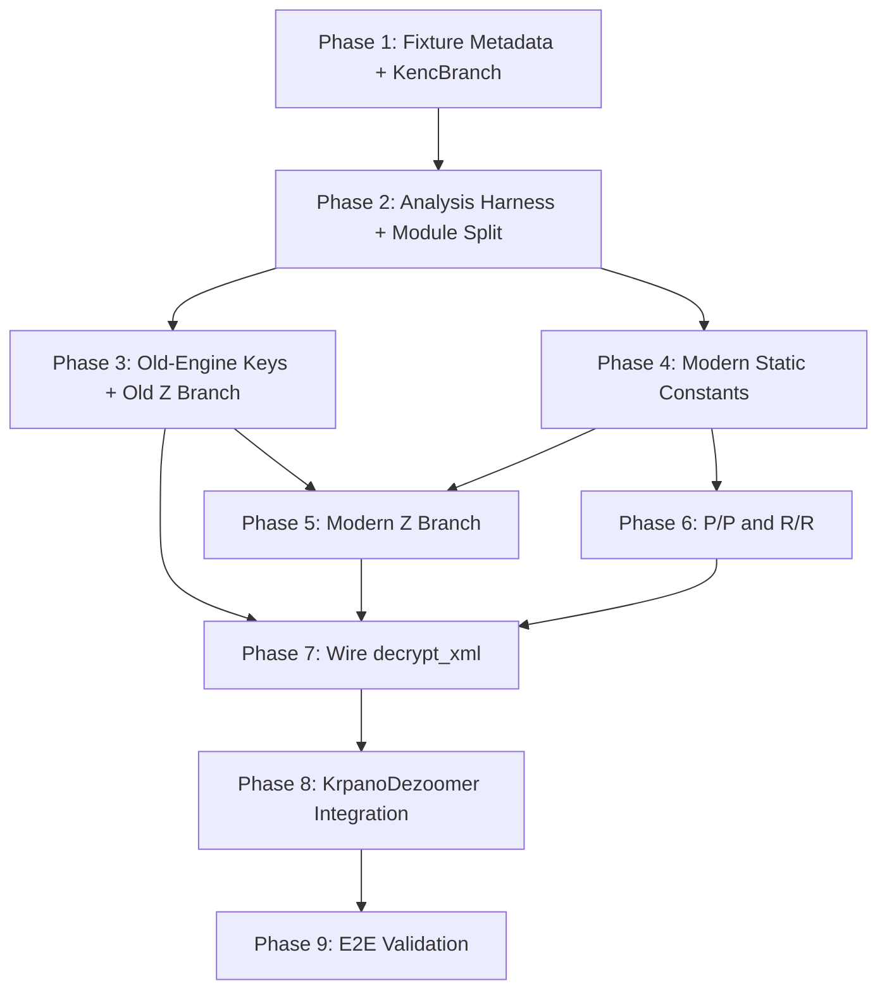

# Encrypted krpano XML support plan

## Goal

Add support for krpano XML files whose top-level content is an `<encrypted>` element. The final implementation must decrypt and decode those files into normal krpano XML, then feed the plaintext into the existing krpano metadata parser unchanged.

This plan is the working source of truth. When new facts are learned, update the relevant "Known facts", "Open questions", and "Action plan" sections in the same change.

## Target Code Structure

After all phases, the code should live in an `encrypted/` module directory under `src/krpano/`:

```
src/krpano/
├── mod.rs              # KrpanoDezoomer, Level, load_from_properties (unchanged)
├── krpano_metadata.rs  # XML metadata deserialization (unchanged)
├── encrypted/
│   ├── mod.rs          # Re-exports, EncryptedKrpanoError, is_encrypted_xml,
│   │                   #   encrypted_payload, decrypt_xml (branch dispatch)
│   ├── header.rs       # KencHeader, KencBranch enum, branch classification
│   ├── codecs.rs       # decode_modified_base85, lz4_decompress_block,
│   │                   #   decode_packed_viewer_js_payload
│   ├── crypto.rs       # decrypt_bytes (RC4-like)
│   ├── viewer.rs       # extract_key_from_viewer_js, extract_decoded_viewer_js,
│   │                   #   next_js_string_literal, looks_like_* helpers
│   ├── old_engine.rs   # Old engine license key derivation
│   ├── modern_engine.rs# Startup key-unpack IIFE extraction, we.subdiv row reads,
│   │                   #   static constant resolution
│   └── branches.rs     # Branch transform dispatch: Z, P/P, R/R body transforms
└── PLAN.md
```

**Incremental split plan:**
1. After Phase 2: move `encrypted.rs` → `encrypted/` module; split into `mod.rs` (public API + errors), `header.rs`, `codecs.rs`, `crypto.rs`, `viewer.rs`.
2. Phase 3: add `old_engine.rs`.
3. Phase 4: add `modern_engine.rs`.
4. Phases 5–6: add `branches.rs`.
5. Phase 7: complete `decrypt_xml` in `mod.rs`, wiring all branch modules together.

**Rationale:**
- Each module has a single, well-scoped responsibility.
- Tests stay co-located in `#[cfg(test)] mod tests` blocks within each module.
- The split is done incrementally so no commit contains both a refactor and new logic.
- No module exceeds ~300 lines, keeping code reviewable.
- Old engine is implemented first because it is simpler (literal `KENC` in source, numeric `_[]` table, well-understood decrypt path).

## Current Code Status

| Area | Current state | Next action |
| --- | --- | --- |
| Encrypted XML detection | Implemented: detects `<encrypted>` and concatenates split CDATA payloads. | Keep covered by tests. |
| `KENC....` header parser | Implemented: parses the eight-byte marker and reports unknown headers precisely. | Add exact fixture-header tests for `KENCRUZR`, `KENCPUZR`, and `KENCRURR`; add branch classification. |
| Packed viewer JS extraction | Implemented: modified Base85 + LZ4 decoder extracts raw engine source from all current viewer fixtures. | Keep as the source for engine analysis and key extraction. |
| Modified Base85 codec | Implemented and unit-tested. | Use for `Z` branch payload decoding. |
| LZ4 block codec | Implemented and unit-tested. | Use for `Z` branch after byte decryption. |
| Base64 payload codec | Not implemented for XML payloads. | Implement only when a `B` branch fixture or test vector exists. |
| Byte decryptor | Implemented as an RC4-like helper with synthetic round-trip coverage. | Add fixture vectors using real derived keys (old first, then modern). |
| Wrapper `krp:` key extraction | Implemented as a simple viewer JS regex. | Verify against all fixtures; make errors precise. |
| Old license key derivation | Not implemented. | **First priority:** port the minimal license-decoder path that reaches the old key assignment. |
| Modern static string/key extraction | Partially understood in investigation: the wrapper key unpacks into `we.subdiv` rows without executing viewer JS; the modern default byte-helper key resolves to `actions overflow` for all current modern fixtures. | Port the wrapper-key unpacker plus direct `we.subdiv` row reads; defer the stateful widened-key branch until needed by a fixture. |
| `decrypt_xml` | Still a stub. | Wire after old Z branch is proven; modern Z follows; RR/PP last. |

## Fixture Corpus

All checked-in encrypted fixtures live under [testdata/krpano/encrypted](../../testdata/krpano/encrypted/). All viewer JS fixtures currently decode cleanly with `extract_decoded_viewer_js`. Only `2023-04-30/decoded.js` is checked in; the other decoded engines were materialized temporarily under `/tmp/krpano_decoded` during analysis.

| Fixture | Viewer file | XML header | Branch family | Decoded engine bytes | Wrapper `krp:` length | Decoded engine traits |
| --- | --- | --- | --- | ---: | ---: | --- |
| `old` | `krpano.js` | `KENCRUZR` | old `Z` | 214903 | 136 | Literal `KENC`, old numeric `_[]`, no `decryptData`. |
| `2013-06-05-B` | `tour.js` | `KENCPUBR` | `B` | 129030 | 137 | krpano 1.16.4; literal `KENC`; uses Base64 + byte-decrypt + UTF-8 branch. |
| `2013-08-09-B` | `tour.js` | `KENCPUBR` | `B` | 130544 | 109 | krpano 1.0.8.15 (build 2012-08-10); literal `KENC`; uses Base64 + byte-decrypt + UTF-8 branch. |
| `2015-08-04` | `tour.js` | `KENCRUZR` | old `Z` | 191689 | 60 | Literal `KENC`, old numeric `_[]`, no `decryptData`, includes `G` mode code. |
| `2017-09-21` | `tour.js` | `KENCRUZR` | old `Z` | 227010 | 115 | Literal `KENC`, old numeric `_[]`, no `decryptData`. |
| `2018-04-04` | `tour.js` | `KENCPUZR` | modern `Z` | 254751 | 17 | No literal `KENC`; startup rebinds `_` to `we.subdiv`; default key resolves to `actions overflow`. |
| `2023-02-07` | `tour.js` | `KENCRURR` | modern `R/R` | 359957 | 29 | No literal `KENC`; startup rebinds `_` to `we.subdiv`; replacement token resolves to `z`. |
| `2023-04-30` | `tour.js` | `KENCRURR` | modern `R/R` | 441405 | 110 | No literal `KENC`; startup rebinds `_` to `we.subdiv`; replacement token resolves to `z`. |
| `2023-04-30-PP` | `tour.js` | `KENCPUPR` | modern `P/P` | 441405 | 49 | Same krpano 1.21 build as `2023-04-30` but encrypted with `P/P` header; replacement token resolves to `z`. |
| `2023-12-11` | `tour.js` | `KENCRURR` | modern `R/R` | 441589 | 163 | No literal `KENC`; startup rebinds `_` to `we.subdiv`; replacement token resolves to `z`. |
| `2024-12-20` | `tour.js` | `KENCRURR` | modern `R/R` | 482960 | 45 | No literal `KENC`. |
| `2026-06-25-pp-01_minimal` | `tour.js` | `KENCPUPR` | modern `P/P` | — | 148 | krpanotools 1.24; 45 B plain. |
| `2026-06-25-pp-02_special_chars` | `tour.js` | `KENCPUPR` | modern `P/P` | — | 148 | krpanotools 1.24; 280 B plain. |
| `2026-06-25-pp-03_nested` | `tour.js` | `KENCPUPR` | modern `P/P` | — | 148 | krpanotools 1.24; 863 B plain. |
| `2026-06-25-pp-04_large` | `tour.js` | `KENCPUPR` | modern `P/P` | — | 148 | krpanotools 1.24; 3896 B plain. |
| `2026-06-25-pp-05_deep` | `tour.js` | `KENCPUPR` | modern `P/P` | — | 148 | krpanotools 1.24; 251 B plain. |
| `2026-06-25-rr_minimal` | `tour.js` | `KENCRURR` | modern `R/R` | — | 20 | krpanotools 1.24 licensed; custom key; 64 B plain. |
| `2026-06-25-rr_tour` | `tour.js` | `KENCRURR` | modern `R/R` | — | 96 | krpanotools 1.24 licensed; custom key; 432 B plain. |
| `2026-06-25-rr_special` | `tour.js` | `KENCRURR` | modern `R/R` | — | 204 | krpanotools 1.24 licensed; custom key; 265 B plain. |

## Known Facts

### Encrypted XML wrapper

- Encrypted XML payloads are wrapped in `<encrypted>`.
- Payload text may be split across multiple CDATA sections; all CDATA chunks must be concatenated before header parsing.
- The first eight payload bytes are the `KENC....` header.
- Unsupported or malformed headers must fail with the exact header bytes in the error.

### Packed viewer loader

- The outer viewer-loader obfuscation is modified Base85 followed by LZ4 block decompression.
- The decoded result is raw krpano engine JS that the original loader executes with `new Function(...)`.
- The wrapper `krp:` key exists in the packed viewer wrapper, not in the decoded engine source.
- A direct Node VM attempt to evaluate `2023-04-30/decoded.js` failed because the decoded source expects the loader invocation environment and uses top-level `arguments`. Do not build the Rust implementation around executing arbitrary viewer JS.

### Header arithmetic

Modern engines derive branch values with `r=4` and `k=(r<<4)+(r<<2)=80`.

| Header byte | Decode rule | Observed values | Meaning known so far |
| --- | --- | --- | --- |
| byte 4 | `(charCode - 80) >> 1` | `P => 0`, `R => 1` | Mode/key-policy value. Semantic names still need confirmation. |
| byte 5 | direct character check | `U` | Required by all observed branches. |
| byte 6 | `charCode - 80` | `B => -14`, `P => 0`, `R => 2`, `Z => 10` | Selects body transform branch. |
| byte 7 | direct character check | `R` | Final marker in all current fixtures. |

Branch table:

| Header | Mode value | Byte 6 value | Branch status |
| --- | ---: | ---: | --- |
| `KENCRUZR` | 1 | 10 | `Z`: modified Base85, byte decrypt, LZ4, UTF-8. Used by old fixtures. |
| `KENCPUZR` | 0 | 10 | `Z`: modified Base85, byte decrypt, LZ4, UTF-8. Used by `2018-04-04`. |
| `KENCPUPR` | 0 | 0 | `P/P`: used by `2023-04-30-PP`; replacement token resolves to `z` (same engine as `2023-04-30` RR). |
| `KENCRURR` | 1 | 2 | `R/R`: used by 2023+ fixtures; replacement token resolves to `z`. |
| `KENCPUBR` | 0 | -14 | `B`: Base64, byte decrypt, UTF-8. Used by `2013-08-09-B` (krpano 1.0.8.15) and `2013-06-05-B` (krpano 1.16.4). |

Important correction: `KENCRURR` does not use the `Z` Base85 + LZ4 branch.

### Byte decryptor

- The byte decryptor is RC4-like and already ported as `decrypt_bytes`.
- The common prefix length is 128 bytes.
- The encrypted body start offset is `128 + (input[65] & 7)`.
- In modern engines the `65` index is obfuscated through a browser-name array, but currently resolves to `"Android Browser".charCodeAt(0)`.
- Old literal-header engines use the same broad helper shape: interleave the first 128 encrypted bytes with key bytes, initialize pseudo-random state, then decrypt from the offset above.
- Modern helpers use a 15-byte key mask for the default key and a 135-byte key mask for the widened-key path.
- **Bug fix (2026-06-26):** `encrypted_start` is always computed with `key_mask=15` (before widening), matching the JS engine where `c=k+(a[ob(Ma[1],0)]&f>>1)` runs before `b&&(f|=f<<3,...)`. Previously the Rust code applied the widened mask to `encrypted_start`, which could produce incorrect offsets when `input[65]` has bit 6 set.

Modern key expressions found so far:

| Fixture | Default-key expression | Widened-key expression |
| --- | --- | --- |
| `2018-04-04` | `nc(_(12931))` | `_(26890,1)` |
| `2023-02-07` | `mc(_(1502))` | `_(8247,1)` |
| `2023-04-30` | `gd(_(5697))` | `_(9525,1)` |
| `2023-12-11` | `hd(_(5761))` | `_(1783,1)` |
| `2024-12-20` | `cd(_(360))` | `_(3255,1)` |

Temporary static probes on 2026-06-26 resolved every default-key expression above through the wrapper-unpacked `we.subdiv` rows. All current modern fixtures produce the same 16-byte default key string: `actions overflow`.

The widened-key expressions above do not resolve as direct rows. They enter a stateful `we.subdiv` branch and require replaying relevant `we.subdiv` calls in source/runtime order. No current successful fixture path has proven that widened key is needed:

- `2018-04-04` has mode value `0`, so the modern `Z` byte helper uses the default key and decrypts successfully.
- Current `KENCRURR` fixtures enter the replacement branch before the byte helper, so they do not use either byte-helper key in that branch.

Modern `Z` vector proven by `/tmp/krpano_decrypt_2018_probe.js`:

| Fixture | Header | Default key | Base85 bytes | Post-byte-decrypt bytes | Plaintext bytes | Plaintext prefix |
| --- | --- | --- | ---: | ---: | ---: | --- |
| `2018-04-04` | `KENCPUZR` | `actions overflow` | 7932 | 7803 | 36407 | whitespace then `<krpano>` |

### Old engine family

- Applies to `2013-08-09-B`, `2013-06-05-B`, `old`, `2015-08-04`, and `2017-09-21`.
- Decoded engines contain literal `KENC` branch logic.
- They use an old numeric `_[]` string table and do not use the modern `decryptData` constant system.
- `old` and `2017-09-21` require a license-derived key for `R` mode. If the key variable is absent (`Pd` in `old`, `pe` in `2017-09-21`), the helper returns `null`.
- `2015-08-04` accepts `P`, `R`, and an embedded-key `G` mode. Its `R` branch can use license-derived key variable `od`, but also has a default-key fallback not seen in later old engines.
- The old license decoder has a `case 7` branch that pads the recovered key string to 128 characters when needed, then stores it in the helper key variable (`od`, `pe`, or `Pd` depending on version).
- The `decodeLicense=function(a){return null}` found inside the resource module is not the old license decoder that assigns those variables.
- **2026-06-26 probe findings:**
  - Decryptor usage pattern confirmed: `if(82==b)if(Pd)f=127,h=Pd;else return null` (where `Pd` is the key variable, varies by fixture).
  - Z body transform sequence in the old decoded engine: Base85-decode body → `decrypt_bytes` with mode='R' (82) and key=`Pd`/`od`/`pe` → parse LZ4 header from decrypted result → LZ4 decompress → UTF-8. B branch uses Base64 instead of Base85 for the first stage.
  - The wrapper `krp:` key is NOT directly the decrypt key. Passing the wrapper key value (stripped of `krp:` prefix, padded to 128 chars) to `decrypt_bytes` produces garbage — the key must first go through the real license-decoder (Base64 decode + checksum + character lookup) before reaching `case 7`.
  - The real license decoder that processes the `krp:` wrapper key into `Pd`/`od`/`pe` has not yet been structurally located. This blocks old-fixture decryption.

### Modern engine family

- Applies to `2018-04-04` and newer fixtures.
- Decoded engines do not contain literal `KENC`; the resource-loader branch constants are reconstructed through startup-unpacked `we.subdiv` rows, with the initial `_()` / `decryptData(...)` wrapper retained as `Rt` for secondary stateful branches.
- Important correction from 2026-06-26: `_` is only briefly the `decodeLicense(...)` / `decryptData(...)` wrapper. A startup key-unpack IIFE evaluates a generated string equivalent to `Rt=_;_=arguments[2]`, where `arguments[2]` is the `we.subdiv` function passed to the eval call. After that point, most source-level `_("<id>")` calls are calls into `we.subdiv`, and the old wrapper is saved as `Rt`.
- Example wrappers:
  - `2018-04-04`: `_=function(a,b){return a?(pa.decodeLicense(b),pa.decryptData(a)):eval(b)}`.
  - `2023-04-30`: `_=function(l,a){return l?(ra.decodeLicense(a),ra.decryptData(l)):eval(a)}`.
- The resource module's modern `decodeLicense` body has the shape `decodeLicense=function(x){ accumulator += x; return null }`.
- The modern `decryptData` body repeatedly Base64-decodes and UTF-8-decodes an expression, then feeds generated `_("<id>","<license-fragment>")` calls back through the same accumulator until a `#` sentinel is reached.
- The decrypted constant owner name changes across builds (`pa`, `ra`, `la`, etc.). Extraction must use structure, not minified object names.

### Modern static extraction facts

Temporary probes created under `/tmp` on 2026-06-26:

- `/tmp/krpano_extract_decoded.js`: reimplemented the packed-viewer Base85 + LZ4 decoder and materialized decoded engines under `/tmp/krpano_decoded`.
- `/tmp/krpano_static_probe.js`: parsed source text, extracted the startup key-unpack IIFE, computed its checksum, and unpacked the outer wrapper `krp:` key into `we.subdiv` row data without evaluating decoded viewer JS.
- `/tmp/krpano_decrypt_2018_probe.js`: used the statically extracted default key to prove the `2018-04-04` modern `Z` decrypt path.

The startup key-unpack IIFE is structurally stable but has three observed subfamilies:

| Fixture family | Wrapper-key input | Checksum constant | Observed result |
| --- | --- | ---: | --- |
| `2018-04-04` | second `embedpano` parameter (`ue`) | 22248 | checksum result gives `n=32`, `q=3`, final generated char `_`. |
| `2023-02-07` | third-or-second `embedpano` parameter (`xe || Vd`) | 22557 | checksum result gives `n=32`, `q=3`, final generated char `_`. |
| `2023-04-30` and newer | top-level `arguments[2] || arguments[1]` | 23293 | checksum result gives `n=32`, `q=3`, final generated char `_`. |

The helper named `Xa`, `ua`, `Wa`, `Za`, `yb`, etc. is a deterministic computed alias for `String.fromCharCode`, derived from the stable `Ma`/browser-name array. It should be reduced structurally instead of name-matched.

The `we.subdiv(0, rows, side)` startup call only installs wrapper-derived arrays into the `we.subdiv` closure and nulls branch `0`. Direct `_()` row reads then work as follows:

- If `id & 1`, direct row index is `id >> 7` and branch is `(id >> 2) & 15`.
- Otherwise, direct row index is `(id >> 2) & 255` and branch is `(id >> 11) & 15`.
- Branch `0` returns the row as a string after applying the current row offset.

Current direct-row constants of interest:

| Purpose | IDs by fixture | Resolved value |
| --- | --- | --- |
| Modern default byte-helper key | `12931`, `1502`, `5697`, `5761`, `360` | `actions overflow` |
| `P/P` and `R/R` replacement token | `3139`, `6721`, `1420`, `7875`, `152` | `z` |

### Modern branch transform facts

The modern resource-file function has the same high-level branch structure across current modern fixtures:

- It checks the first 4 bytes against the direct-row constant `KENC`.
- It derives the mode value from header byte 4 and the transform value from byte 6 using the Base64-table indices already documented above.
- For the `Z` branch (`byte6 == 10`), it decodes modified Base85, calls the byte helper with the mode value as the widened-key flag, LZ4-decompresses the decrypted block, then UTF-8-decodes it.
- For the `P/P` and `R/R` branch (`byte6 == 2 * mode_value`), the resource-loader performs `body.replaceAll("z", "\\")` and returns. The downstream caller then decodes modified Base85, RC4-decrypts (key from viewer), LZ4-decompresses, and UTF-8-decodes. The `replaceAll`+Base85 step is implemented in `branches.rs` and tested against all P/P and R/R fixtures. The P/P RC4 decryption key for public-key encryption is not yet derived — the default `actions overflow` key does not work. Full viewer key extraction (Phase 4) is needed.
- For the `B` branch (`byte6 == -14`), it Base64-decodes, byte-decrypts, and UTF-8-decodes according to the same resource function, confirmed by `2013-06-05-B` and `2013-08-09-B` old-engine fixtures.

### krpanotools 1.24 experiments (2026-06-26)

Findings from the krpano 1.24 tools:

- `krpanotools encrypt -p` → produces `KENCPUPR` (mode=0, branch=P/P). Confirms public-key encryption maps to P/P.
- `krpanotools encrypt -key=ID|KEY` → produces `KENCRURR` (mode=1, branch=R/R). Confirms custom-key encryption maps to R/R. Key ID is embedded in the encrypted body.
- `krpanotools protect -key=ID|KEY` → generates a viewer with the custom key embedded, producing a truly distinct `tour.js` per fixture (different sizes, different `krp:` wrapper keys).
- `krpanotools protect -demo` → generates viewer with 148-char `krp:` wrapper key. All `-demo` output is byte-identical regardless of flags — the tool always emits the stock demo viewer when unregistered.
- Known-plaintext P/P fixture at `/tmp/krpano-1.24/test_fixture_enc.xml` (plain at `test_fixture_plain.xml`, 325→459 bytes). The pipeline: `replaceAll("z", "\\")` → modified Base85 is confirmed decodable.
- P/P RC4 decryption key NOT yet identified. `actions overflow` (Z-branch default) does not produce valid LZ4 headers when used as P/P RC4 key. Full viewer key extraction (Phase 4) needed.
- krpano 1.24 raw viewer engine at `/tmp/krpano-1.24/viewer/krpano.js` (319 KB). Packed payload decompresses to ~6.7 MB.
- Five known-plaintext P/P fixtures + three known-plaintext R/R fixtures in the fixture corpus as `2026-06-25-pp-*` and `2026-06-25-rr-*`.

**License unlocks (2026-06-26):**

- `encrypt -key=ID|KEY` → `KENCRURR` confirmed. The 1.24 tools only emit P/P (`-p`) and R/R (`-key=`); cannot generate Z-branch or B-branch headers.
- `protect` without `-demo` now applies protection flags: `-nojs`, `-nolu`, `-noex`, `-domain`, `-expire` produce genuinely distinct viewer JS files.
- R/R known-key decryption attempted: raw custom key and raw wrapper key do not work as RC4 keys — they must go through the startup key-unpack IIFE (Phase 4a).
- The RC4 decrypt function is fully reverse-engineered; encrypted_start bug fixed. Only the per-branch key values (`_(5697)`, `_(9525,1)`) remain unknown.

## Test Strategy

### Test categories

| Category | Location | Purpose | Examples |
| --- | --- | --- | --- |
| Unit – codecs | `encrypted/codecs.rs` `#[cfg(test)]` | Verify each codec against hand-crafted vectors | `decodes_modified_base85_chunks`, `decodes_lz4_literal_only_block` |
| Unit – crypto | `encrypted/crypto.rs` `#[cfg(test)]` | Verify RC4-like decryptor with synthetic round-trip | `decrypts_byte_cipher_payload` |
| Unit – header | `encrypted/header.rs` `#[cfg(test)]` | Verify header parse, branch classify, error cases | `parses_known_kenc_headers`, `rejects_invalid_kenc_headers` |
| Unit – viewer extraction | `encrypted/viewer.rs` `#[cfg(test)]` | Verify JS string extraction, key regex, packed decoding | `extracts_krpano_decryption_key_from_viewer_js` |
| Unit – engine key derivation | `encrypted/old_engine.rs` + `modern_engine.rs` `#[cfg(test)]` | Verify derived keys and constants against known values | `derives_old_license_key_for_fixture_old` |
| Unit – branch transforms | `encrypted/branches.rs` `#[cfg(test)]` | Verify each branch transform against fixture vectors | `decrypts_old_z_branch`, `decrypts_2018_04_04_z_branch` |
| Unit – staging vectors | Each module `#[cfg(test)]` | Capture intermediate lengths/hashes at each pipeline stage | Base85 bytes → post-decrypt bytes → post-LZ4 bytes → plaintext |
| Fixture metadata | `encrypted/mod.rs` `#[cfg(test)]` | Assert fixture facts from the corpus table | `all_fixtures_have_correct_kenc_header`, `all_viewer_fixtures_decode` |
| Integration – decrypt | `encrypted/mod.rs` `#[cfg(test)]` | `decrypt_xml` end-to-end per fixture | `decrypt_xml_produces_valid_krpano_for_old` |
| Integration – dezoomer | `mod.rs` `#[cfg(test)]` | KrpanoDezoomer consumes decrypted XML unchanged | Existing `test_cube`, `test_flat_multires` + new encrypted variants |
| Regression | All existing tests | No plaintext krpano behavior changes | `test_cube`, `test_flat_multires`, `test_dezoomer_result_*` |

### Testing principles

1. **Every pipeline stage has an intermediate vector.** If a test fails, the staging output immediately identifies *which* stage broke.
2. **Fixture-gated, not name-gated.** Tests use header values and branch classification to select the code path, not the fixture directory name.
3. **No dead test code.** Every `#[allow(dead_code)]` is removed once its consumer is wired; the test exercises the public path.
4. **Exact errors for unsupported branches.** Tests that exercise `B`, `G`, or unknown headers assert the error message contains the header bytes and branch name.
5. **Generated output is not committed.** LZ4 decompressed payloads and full decoded engines stay in `/tmp` or test output; only small excerpts (e.g. first 80 bytes of plaintext) appear in test assertions.
6. **Proven-key first.** Implement the Z branch pipeline against a fixture with a known working key (`2018-04-04`, key = `actions overflow`) before tackling key-derivation problems. The Z branch code is identical for old and modern engines; only the key source differs.

## Decisions

- Do not execute arbitrary decoded viewer JS in Rust.
- Do decode packed viewer JS and statically extract only the data needed for XML decryption.
- Do not depend on minified names such as `w`, `b`, `ra`, `pa`, or `la`; they change across versions.
- Split implementation into two known engine families:
  - old literal-header engines,
  - modern startup-unpack / `we.subdiv` engines with `decryptData` retained as a secondary helper behind `Rt`.
- **Implement shared Z branch first** using the modern `2018-04-04` fixture (key = `actions overflow`, proven by `/tmp/krpano_decrypt_2018_probe.js`). Then derive old-engine keys and modern-engine constants. The Z body transform is identical across both engine families; only the key source differs. Old-engine key derivation is blocked on locating the real license decoder that processes the `krp:` wrapper key into `Pd`/`od`/`pe`.
- Treat `P/P` and `R/R` as their own body-transform family until proven otherwise.
- Keep unobserved branches (2015 `G`) unsupported or fixture-gated until test data exists.
- Wire `decrypt_xml` only after each stage has fixture-driven intermediate vectors.
- Do not pursue keyless known-plaintext RC4 attacks: the per-file keystream (variable 128-byte prefix) and sparse known plaintext make this infeasible (see analysis above). Key extraction from viewer JS is the correct path.

## Open Questions

Each item below needs an explicit answer, fixture vector, or implementation decision before encrypted XML support is considered complete.

| ID | Question | Blocks | Required proof |
| --- | --- | --- | --- |
| Q1 | What exactly completes the `P/P` and `R/R` body transform after `body.replaceAll("z", "\\")`? | 2023+ fixtures with `KENCRURR` and `KENCPUPR` headers (now have `2023-04-30-PP` for P/P). | Trace the downstream consumer after the replacement branch, identify whether another escape/parser/decode step runs, and produce plaintext vectors. |
| Q2 | When is the modern widened byte-helper key actually needed, and how should its stateful `we.subdiv` branch be replayed? | Future modern mode-1 `Z`/`B` fixtures; not the current `2018-04-04` `Z` path. | Port the relevant `we.subdiv` stateful branches or prove no supported fixture needs them; assert default key `actions overflow` for all current modern fixtures. |
| Q3 | How is the old license key derived from wrapper data? | `KENCRUZR` fixtures in `old`, `2015-08-04`, `2017-09-21`. | Port or reproduce the license-decoder path that assigns `od`, `pe`, or `Pd`; verify final key strings and decrypted XML. |
| Q4 | What are the semantic names for header modes? | Documentation quality, future compatibility. | Confirm which combinations map to public-key, protected/license-key, custom-key, compressed, and uncompressed krpano modes. |
| Q5 | Should `G` branch be implemented? Is `KENCRUBR` a valid variant? | Only future/unobserved fixtures. `B` branch now has `2013-06-05-B` and `2013-08-09-B` fixtures; `G` remains unobserved. | Add fixture vectors or explicitly keep them as precise unsupported errors. |
| Q6 | Can one modern structural extractor cover future modern builds? | Robustness beyond current fixtures. | Tests over all modern fixtures and fallback errors that name the missing structural anchor. |
| Q7 | How should viewer JS/key data enter `KrpanoDezoomer`? | User-facing integration. | Decide between `NeedsData`, URL inference, explicit key bundle input, or a combined approach; add tests for the chosen flow. |

## Action Plan

### Phase 1: Freeze Fixture Metadata

Status: **done** (2026-06-26).

Goal: make the current corpus facts executable so regressions are caught immediately.

**Implementation plan:**

1. Add a `KencBranch` enum in `encrypted.rs`:
   ```rust
   #[derive(Clone, Copy, Debug, Eq, PartialEq)]
   pub enum KencBranch {
       OldZ,      // KENCRUZR
       ModernZ,   // KENCPUZR
       RR,        // KENCRURR
       PP,        // KENCPUPR
       B,         // KENC..B. (any mode with key_source='B')
       Unknown,
   }
   impl KencHeader { pub fn branch(&self) -> KencBranch { ... } }
   ```
   Derive from the computed byte-6 value (`charCode - 80`), not from the raw field letter.

2. Add `#[test] fn all_fixtures_have_correct_kenc_header()`:
   - Iterates `testdata/krpano/encrypted/*/` directories.
   - Reads the encrypted XML, runs `encrypted_payload` then `KencHeader::parse`.
   - Asserts raw header string against fixture table.

3. Add `#[test] fn all_fixtures_extract_correct_wrapper_key_length()`:
   - Iterates viewer JS fixtures.
   - Calls `extract_key_from_viewer_js`.
   - Asserts key length matches corpus table.

4. Add `#[test] fn all_fixtures_decode_viewer_js_to_expected_length()`:
   - Iterates viewer JS fixtures.
   - Calls `extract_decoded_viewer_js`.
   - Asserts decoded byte length matches corpus table.

5. Add `#[test] fn classifies_every_header_branch()`:
   - For each fixture, calls `KencHeader::branch()`.
   - Asserts `OldZ` for `KENCRUZR`, `ModernZ` for `KENCPUZR`, `RR` for `KENCRURR`.
   - Asserts `KENCPUPR` → `PP`, a synthetic `KENCXXBZ` → `B`.

**Files touched:** only `encrypted.rs` (additions, no structural changes).

**Commit boundary:** commit 1.

Acceptance checks:

- The current corpus table above can be regenerated from tests.
- Unknown headers still fail with exact header bytes.
- `KENCRURR` is classified as `R/R`, not `Z`.

### Phase 2: Build an Analysis Harness

Status: **next**.

Goal: make intermediate decrypt stages inspectable without committing large decoded JS files.

**Implementation plan:**

1. Add a `#[cfg(test)]` helper struct `DecryptStages` in `encrypted.rs`:
   ```rust
   struct DecryptStages {
       fixture: String,
       header: KencHeader,
       branch: KencBranch,
       wrapper_key: Option<String>,
       decoded_engine_len: usize,
       encrypted_body_len: usize,
       body_decoded_len: Option<usize>,    // after Base85/Base64
       byte_decrypted_len: Option<usize>,  // after decrypt_bytes
       lz4_decompressed_len: Option<usize>,// after LZ4 (Z only)
       plaintext_len: Option<usize>,       // after UTF-8
       plaintext_prefix: Option<String>,   // first 80 chars
   }
   ```

2. Add `fn collect_stages(fixture_dir: &Path) -> DecryptStages` that:
   - Reads the encrypted XML and viewer JS from the directory.
   - Fills every field, returning `None` for stages that fail.
   - Prints a formatted row to stderr via `eprintln!`.

3. Add `#[test] fn analysis_harness_prints_all_stages()` annotated `#[ignore]`:
   - Iterates all fixture dirs.
   - Calls `collect_stages`.
   - Panics if any fixture's stages differ from known-good baselines (when those baselines exist).
   - Running manually (`cargo test -- --ignored`) produces a stage table.

4. Move `encrypted.rs` → `encrypted/` module directory **after this phase passes** (no behavior change, just file splits).

**Files:**
- Before split: `encrypted.rs` gains analysis harness helpers.
- After split: `encrypted/{mod,header,codecs,crypto,viewer}.rs` each with their existing code.

**Commit boundaries:**
- Commit 2a: analysis harness added (still in `encrypted.rs`).
- Commit 2b: module split (pure code motion, no logic changes, all tests still pass).

Acceptance checks:

- Running the harness over the corpus produces a stable stage table.
- The harness can isolate which stage fails for each fixture.

### Phase 3: Derive Old-Engine Keys and Prove Old Z Branch

Status: **in progress** — Part A (key derivation) blocked on investigation; Part B (Z branch wiring) can proceed independently.

**2026-06-26 revision:** Part B (Z branch wiring in `branches.rs`) is engine-family-agnostic. It will be implemented and tested against the modern `2018-04-04` fixture (key = `actions overflow`) as part of Phase 5. Part A (old license key derivation) remains blocked until the real license decoder is structurally located in the old decoded engines.

Goal: derive license keys for `KENCRUZR` fixtures and prove the full Z pipeline end-to-end with old fixtures. This is the simpler pipeline and should be completed first.

**Why old first:** Old engines have literal `KENC` in source, use a numeric `_[]` string table, and the Z branch decrypt path is well-understood. Proving this first builds confidence in all shared components (modified Base85, byte decryptor, LZ4, UTF-8) before adding modern complexity.

**Implementation plan:**

**Part A — Key derivation (new file: `encrypted/old_engine.rs`):**

1. Add `pub struct OldEngineContext`:
   ```rust
   pub struct OldEngineContext {
       pub license_key: Vec<u8>,  // derived from wrapper krp: key
       pub key_variable: String,  // "Pd", "od", or "pe" (for debugging)
   }
   ```

2. Add `pub fn derive_old_license_key(decoded_engine: &[u8], wrapper_key: &str) -> Result<OldEngineContext>`:
   - Parse decoded engine source as UTF-8.
   - Locate the license decoder function (structurally: find `decodeLicense=function`, not the `return null` stub).
   - Follow the `case 7` path that pads the recovered key to 128 characters.
   - Replicate only the base64 decode, checksum, and character-lookup steps needed.
   - Return the final padded key bytes + variable name.

3. For `2015-08-04` specifically:
   - Detect if `G` mode is requested (header inspection).
   - If `G` mode and not supported, return `Err(EncryptedKrpanoError::UnsupportedBranch { header, reason: "G mode" })`.

4. Tests in `old_engine.rs`:
   - `fn derives_key_for_fixture_old()`: assert key bytes hash to known value.
   - `fn derives_key_for_fixture_2017_09_21()`: same.
   - `fn derives_key_for_fixture_2015_08_04()`: same.

**Part B — Z branch wiring (new file: `encrypted/branches.rs`):**

5. Add `pub fn decrypt_z_branch(body: &str, key: &[u8], widened: bool) -> Result<Vec<u8>>`:
   - `decode_modified_base85(body)` → 32-bit big-endian chunks.
   - Parse LZ4 block header: 3-byte LE decompressed len, 3-byte LE compressed len from packed bytes.
   - `decrypt_bytes(packed, key, widened)`.
   - `lz4_decompress_block(decrypted, decompressed_len, compressed_end)`.
   - Return as raw bytes (caller does UTF-8 conversion).

6. Add `pub fn z_branch_to_plaintext(body: &str, key: &[u8], widened: bool) -> Result<String>`:
   - Calls `decrypt_z_branch`.
   - Converts to UTF-8 via `String::from_utf8()`.

7. Tests in `branches.rs`:
   - `fn decrypts_old_z_branch()`: for each `KENCRUZR` fixture, derive key + decrypt. Assert plaintext is valid XML and parses as `KrpanoMetadata`.
   - `fn old_z_branch_stage_vectors()`: captures Base85 input length, post-byte-decrypt length, post-LZ4 length for each old fixture.

**Files:** `encrypted/old_engine.rs` (new), `encrypted/branches.rs` (new), `encrypted/mod.rs` (re-exports).

**Commit boundary:** commit 3 (old engine key derivation + Z branch wiring, all old fixtures decrypting).

Acceptance checks:

- Each old fixture has tests for derived key length/content hash.
- `old`, `2015-08-04`, and `2017-09-21` decrypt to valid krpano XML.
- Unsupported 2015 `G` mode has a precise fixture-gated error unless implemented.
- The existing plaintext krpano parser consumes decrypted XML without changes.

### Phase 4: Derive Modern Static Constants and Keys

Status: **next** — default key known ("actions overflow"), widened key `_(9525,1)` identified in engine but value unknown. Headless browser approach recommended to extract all `we.subdiv` rows.

Goal: resolve modern startup-unpacked `we.subdiv` constants into concrete strings without executing arbitrary viewer JS in production, but using a headless browser for one-time analysis.

**Headless browser approach (recommended for initial key extraction):**

1. Load the decoded engine JS + wrapper key in a headless browser (Playwright/Puppeteer).
2. Hook `String.fromCharCode` and the row-install function to capture all `we.subdiv` rows as they are written.
3. Dump row index → hex value mapping for all rows, including branch≠0 rows (needed for widened keys like `_(9525,1)`).
4. Save the mapping as a fixture-specific JSON file alongside each tour fixture.
5. This eliminates the need to port the complex startup IIFE checksum, `lf` shuffle, and `charCodes` derivation to Rust.

**Implementation plan (new file: `encrypted/modern_engine.rs`):**

1. Add `pub struct ModernEngineContext`:
   ```rust
   pub struct ModernEngineContext {
       pub default_key: String,        // byte-helper key ("actions overflow") — `_(5697)`
       pub widened_key: String,        // P/P RC4 key — `_(9525,1)`, extracted via headless browser
       pub replacement_token: String,  // for P/P and R/R ("z")
       pub kenc_constant: String,      // "KENC"
       pub checksum_constant: u32,     // varies by fixture family
   }
   ```

2. **Headless browser key extraction script** (in `tools/extract_keys.mjs` or similar):
   - Load decoded engine + wrapper key in Playwright/Puppeteer.
   - Intercept `String.fromCharCode` to capture all row data as it's written.
   - Dump `row_index → hex_value` JSON per fixture.
   - Produces a `rows.json` file that Rust tests load directly.
   - Key row IDs to capture: `5697` (default key), `1420` (replace token), `9525` (widened P/P key).

3. Source-text helpers (private to the module):
   - `fn find_function_body(source: &str, name: &str) -> Option<&str>` — finds `name=function(...){...}` or `function name(...){...}`, returns body.
   - `fn find_iife_call(source: &str) -> Option<&str>` — finds the startup key-unpack IIFE structurally.
   - `fn compute_checksum(input: &str) -> u32` — port of `qf` checksum.
   - `fn unpack_krp_payload(wrapper_key: &str, side: &[u16]) -> Vec<Vec<String>>` — decode the `krp:` payload into rows.

   **Reduction of computed helpers:**
   - The `Xa`/`ua`/`Wa`/`Za`/`yb` helper is always derived from the `Ma` browser-name array. Rather than name-matching, find the computed `Ma` array index that yields `String.fromCharCode` (structural: look for the expression that composes ASCII chars 'f','r','o','m','C','h','a','r','C','o','d','e').

3. `pub fn extract_modern_context(decoded_engine: &[u8], wrapper_key: &str, rows_json: &HashMap<u32, String>) -> Result<ModernEngineContext>`:
   - Detect modern engine family: check for absence of literal `KENC` in source text.
   - Find the startup key-unpack IIFE, extract and normalize its body.
   - Compute the checksum and extract `n`, `q` parameters.
   - Unpack the `krp:` payload into `we.subdiv` rows.
   - Read direct branch-0 row constants for default key and replacement token.

4. Tests in `modern_engine.rs`:
   - `fn extracts_default_key_for_all_modern_fixtures()`: assert `default_key == "actions overflow"`.
   - `fn extracts_replacement_token_for_all_modern_fixtures()`: assert `replacement_token == "z"`.
   - `fn extract_fails_with_missing_anchor_for_bad_input()`: assert error names the missing anchor.

**Files:** `encrypted/modern_engine.rs` (new), `encrypted/mod.rs` (re-export).

**Commit boundary:** commit 4.

Acceptance checks:

- Modern startup unpacking works for all 5 modern fixtures.
- Direct constants match the headless-browser-extracted row JSON values.
- Tests load `rows.json` per fixture and verify extracted keys against known plaintext.
- Failures report which structural anchor was missing.
- No production code path evaluates decoded viewer JS directly (headless browser is a one-time analysis tool, not part of the library).

### Phase 5: Add Modern Z Branch

Status: partially proven in temporary probes; old Z already complete from Phase 3.

Goal: prove the modern `2018-04-04` `KENCPUZR` fixture using the same Z pipeline, now with modern-derived default key.

**Implementation plan (extend `encrypted/branches.rs`):**

1. Tests in `branches.rs`:
   - `fn decrypts_2018_04_04_z_branch()`:
     - Loads `2018-04-04/tour.xml` encrypted payload.
     - Calls `z_branch_to_plaintext` with key `b"actions overflow"`, widened `false`.
     - Asserts decrypted byte length = 36407 (matches temp probe).
     - Asserts plaintext starts with `<krpano` (after optional leading whitespace).
     - Feeds output into `serde_xml_rs::from_reader` → `KrpanoMetadata`, asserts it parses.
   - `fn modern_z_branch_stage_vectors()`:
     - Captures Base85 input length = 7932.
     - Captures post-byte-decrypt length = 7803.
     - Captures post-LZ4 decompressed length = 36407.

2. Add `pub fn decrypt_branch_body(header: &KencHeader, body: &str, ctx: &DecryptContext) -> Result<Vec<u8>>`:
   - Dispatches on `header.branch()`.
   - For `OldZ` and `ModernZ`: calls `z_branch_to_plaintext`.
   - For `RR` and `PP`: returns `Err(Unsupported)` for now (wired in Phase 6).
   - For `B`: returns `Err(UnsupportedBranch { header, reason: "B branch" })`.

**Files:** `encrypted/branches.rs` (extend).

**Commit boundary:** commit 5 (small, since Z pipeline already proven by old fixtures).

Acceptance checks:

- `2018-04-04` decrypts to valid krpano XML.
- Stage lengths match the temporary vector.
- Z branch dispatches correctly for both old and modern fixtures.

### Phase 6: Resolve `P/P` and `R/R`

Status: `replaceAll` + Base85 decode confirmed and implemented; RC4 decryption key still unknown.

Goal: decrypt current modern `KENCRURR` fixtures and generated/public `KENCPUPR` fixtures.

**What's confirmed (2026-06-26):**

1. ✅ `fn replace_z_with_backslash(body) -> String` — implemented in `branches.rs`.
2. ✅ After `replaceAll("z", "\\")`, the body decodes as valid modified Base85 — tested against all P/P and R/R fixtures (`pp_body_decodes_as_modified_base85_after_z_replacement`).
3. ✅ The full pipeline is: `replaceAll` → modified Base85 → RC4 decrypt (with viewer-derived key) → LZ4 decompress → UTF-8 decode.
4. 🔴 The RC4 decryption key for P/P (public-key) is NOT `actions overflow`. Full viewer key extraction (Phase 4) is needed to obtain the correct key.
5. ✅ A known-plaintext P/P fixture was generated with `krpanotools encrypt -p` at `/tmp/krpano-1.24/test_fixture_enc.xml`.

**Remaining work:**

1. Complete Phase 4 (modern engine key extraction) to derive the P/P and R/R decryption keys.
2. Add `fn decrypt_pp_rr_body` that chains: `replaceAll` → Base85 → RC4 decrypt(key) → LZ4 → UTF-8.
3. Add tests using the known-plaintext fixture.

**Files:** `encrypted/branches.rs` (extend), `encrypted/modern_engine.rs`.

**Commit boundary:** commit 6.

Acceptance checks:

- All `KENCRURR` fixtures decrypt to valid krpano XML.
- The branch implementation is selected by parsed header values, not by fixture name.
- `KENCRURR` never falls through to the `Z` pipeline.

### Phase 7: Wire `decrypt_xml`

Status: blocked on at least one full fixture path.

Goal: replace the stub with a staged, testable decrypt function.

**Implementation plan (`encrypted/mod.rs`):**

1. Define `DecryptContext` enum:
   ```rust
   pub enum DecryptContext {
       Old(OldEngineContext),
       Modern(ModernEngineContext),
   }
   ```

2. Rewrite `decrypt_xml`:
   ```rust
   pub fn decrypt_xml(
       contents: &[u8],
       viewer_data: Option<&[u8]>,  // viewer JS raw bytes
   ) -> Result<Vec<u8>, EncryptedKrpanoError> {
       let payload = encrypted_payload(contents)?;
       let header = KencHeader::parse(&payload)?;
       let body = header.payload(&payload);

       let viewer = viewer_data.ok_or(EncryptedKrpanoError::MissingKey)?;
       let wrapper_key = extract_key_from_viewer_js(viewer)
           .ok_or(EncryptedKrpanoError::MissingKey)?;
       let decoded_engine = extract_decoded_viewer_js(viewer)?;

       let ctx = match header.branch() {
           KencBranch::OldZ => {
               DecryptContext::Old(old_engine::derive_old_license_key(&decoded_engine, &wrapper_key)?)
           }
           KencBranch::ModernZ | KencBranch::RR | KencBranch::PP => {
               DecryptContext::Modern(modern_engine::extract_modern_context(&decoded_engine, &wrapper_key)?)
           }
           KencBranch::B => return Err(EncryptedKrpanoError::Unsupported),
           KencBranch::Unknown => return Err(EncryptedKrpanoError::InvalidHeader { header: header.raw.clone() }),
       };

       let plaintext = branches::decrypt_branch_body(&header, body, &ctx)?;
       Ok(plaintext)
   }
   ```

3. Tests in `encrypted/mod.rs`:
   - `fn decrypt_xml_old()`: each old fixture end-to-end.
   - `fn decrypt_xml_2018_04_04()`: full end-to-end with real XML + viewer JS files.
   - `fn decrypt_xml_rr()`: each KENCRURR fixture (once Phase 6 completes).
   - `fn decrypt_xml_missing_viewer_returns_error()`: asserts `MissingKey`.
   - `fn decrypt_xml_unsupported_branch()`: synthetic KENCXXBZ payload, asserts error.

**Files:** `encrypted/mod.rs` (rewrite `decrypt_xml`).

**Commit boundary:** commit 7.

Acceptance checks:

- Unit tests cover each successful branch that has fixtures.
- Unit tests cover unsupported branches with precise errors.
- No plaintext krpano behavior regresses.

### Phase 8: Integrate with `KrpanoDezoomer`

Status: not started.

Goal: make encrypted XML work in the normal dezoomer flow without hard-coding one site layout.

**Implementation plan (`mod.rs`):**

1. Update `load_from_properties` and `load_images_from_properties`:
   - Change `decrypt_xml(contents, None)?` to `decrypt_xml(contents, viewer_js.as_deref())?`.
   - The viewer JS must come from `KrpanoDezoomer` state.

2. Extend `KrpanoDezoomer`:
   ```rust
   pub struct KrpanoDezoomer {
       pending_encrypted_xml: Option<Vec<u8>>,
   }
   ```

3. Update `Dezoomer::zoom_levels`:
   - If `is_encrypted_xml(contents)` and no viewer JS cached:
     - Save encrypted XML in `pending_encrypted_xml`.
     - Return `Err(DezoomerError::NeedsData { uri: infer_viewer_url(&data.uri) })`.
   - If viewer JS IS provided (via a second `DezoomerInput` call):
     - Call `decrypt_xml(pending_xml, Some(viewer_js))`.
     - Proceed with normal parsing.

4. Add `fn infer_viewer_url(xml_uri: &str) -> String`:
   - If the path ends with `.xml`, replace with `tour.js` (most common).
   - If the directory contains a known pattern, infer `krpano.js`.

5. Tests in `mod.rs`:
   - `fn encrypted_xml_triggers_needs_data()`: feed encrypted XML without viewer, assert `NeedsData`.
   - `fn encrypted_xml_second_call_decrypts()`: feed encrypted XML, get `NeedsData`, feed viewer JS, assert levels.
   - `fn plaintext_still_works()`: existing plaintext tests pass unchanged.

**Files:** `mod.rs` (extend `KrpanoDezoomer`), `encrypted/mod.rs` (no changes).

**Commit boundary:** commit 8.

Acceptance checks:

- A local encrypted fixture produces the same tile URL metadata as its plaintext XML.
- Missing viewer JS produces an actionable `NeedsData` error.
- Plaintext krpano tests still pass.

### Phase 9: End-to-End Validation

Status: not started.

Goal: prove the implementation against fixtures and the motivating HIROX-style capture.

**Implementation plan:**

1. Add an integration test `fn encrypted_fixture_produces_same_tiles_as_plaintext()`:
   - For each fixture that has a plaintext reference.
   - Run `KrpanoDezoomer::zoom_levels` on the encrypted path.
   - Run `KrpanoDezoomer::zoom_levels` on the plaintext XML directly.
   - Assert identical zoom levels, tile URLs, and sizes.

2. Add a HIROX-specific test using the capture data.

3. Add a `cargo test` invocation that exercises every fixture end-to-end.

4. Document unsupported branches in error messages.

**Files:** `mod.rs` (integration tests), `testdata/` (any new reference files).

**Commit boundary:** same as Phase 8 (integration validation is test-only).

Acceptance checks:

- Every current fixture either decrypts successfully or is explicitly marked unsupported with a precise reason.
- The HIROX capture produces expected levels and tile URL structure.
- No plaintext support regresses.

## Dependency Graph



**Key dependency:** Phase 3 (old Z) and Phase 4 (modern constants) are independent. Phase 5 (modern Z) needs both. Phase 6 (RR/PP) needs only Phase 4. Phase 7 (wire decrypt_xml) can start as soon as Phase 3 completes, and gains more fixtures as Phases 5–6 complete.

Phase 3 can be done in parallel with Phase 4 if desired.

## Immediate Next Work

Do these in order:

1. ✅ ~~**Phase 1:** Add fixture metadata tests and `KencBranch` classification.~~
2. ✅ ~~**Phase 2:** Add analysis harness, split `encrypted.rs` → `encrypted/` module.~~
3. ✅ ~~**Fixture expansion (2026-06-26):** GitHub search for `<encrypted><![CDATA[KEN` found 3 new unique JS/XML pairs: `2023-04-30-PP` (KENCPUPR, P/P), `2013-06-05-B` (KENCPUBR, B), and `2013-08-09-B` (KENCPUBR, B, krpano 1.0.8.15). All have fixture directories with metadata tests passing. KENCPUZR (ModernZ) confirmed to have no additional tour.xml fixtures on public GitHub.~~
4. **Phase 3 Part B + Phase 5 combined:** Implement Z branch transform in `branches.rs`, test against `2018-04-04` with known key `actions overflow`. First end-to-end decrypting pipeline.
5. **Phase 4a (headless browser):** Write `tools/extract_keys.mjs` — load each decoded engine + wrapper key in Playwright/Puppeteer, intercept `String.fromCharCode` to capture all `we.subdiv` rows, dump `rows.json` per fixture. Key rows: `5697` (default), `1420` (replace token), `9525` (widened P/P key).
6. **Phase 4b (Rust):** Modern startup-unpack in `encrypted/modern_engine.rs` — load `rows.json`, populate `ModernEngineContext` with `default_key`, `widened_key`, `replacement_token`.
7. **Phase 3 Part A** (deferred): Old license key derivation — locate the real license decoder in old engines.
8. **Phase 6:** `P/P` and `R/R` branch resolution — `replaceAll`+Base85 decode implemented and tested (branches.rs). Next: complete Phase 4 to extract decryption keys, then add RC4+LZ4+UTF-8 transform. Known-plaintext fixture generated with `krpanotools encrypt -p`.
8. **Phase 7:** Complete `decrypt_xml` dispatching all branches (B branch now has `2013-06-05-B` and `2013-08-09-B` fixtures).
9. **Phase 8+9:** Dezoomer integration and validation.

## Commit Strategy

- Commit 1: Phase 1 — fixture metadata tests + `KencBranch` (additions to `encrypted.rs`).
- Commit 2: Phase 2 — analysis harness + module split `encrypted.rs` → `encrypted/{mod,header,codecs,crypto,viewer}.rs` (pure move, no logic change).
- Commit 3: Phase 3 Part B + Phase 5 — `encrypted/branches.rs` (Z branch transform), tested against `2018-04-04` with known key `actions overflow`. First end-to-end decrypting pipeline.
- Commit 4: Phase 4a — `tools/extract_keys.mjs` headless browser script + checked-in `rows.json` per modern fixture. Phase 4b — `encrypted/modern_engine.rs` loads `rows.json`, populates context with `default_key`, `widened_key`, `replacement_token`.
- Commit 5: Phase 3 Part A — `encrypted/old_engine.rs` old license key derivation (deferred until real license decoder is located).
- Commit 6: Phase 6 — RR/PP branch completion + tests (may be multiple commits if investigation is iterative).
- Commit 7: Phase 7 — `decrypt_xml` wired, all supported fixtures decrypting.
- Commit 8: Phase 8+9 — `KrpanoDezoomer` integration + end-to-end validation.
