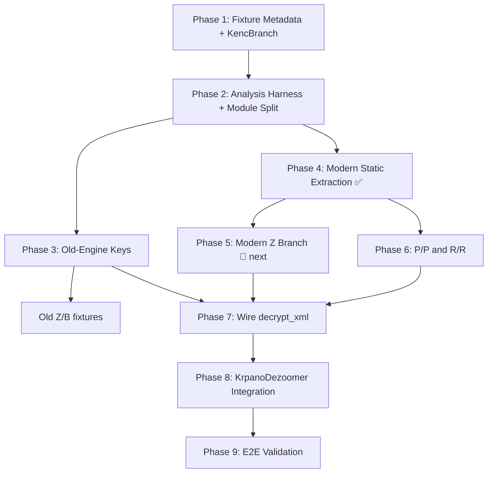

# Encrypted krpano XML support plan

## Goal

Add support for krpano XML files whose top-level content is an `<encrypted>` element. The final implementation must decrypt and decode those files into normal krpano XML, then feed the plaintext into the existing krpano metadata parser unchanged.

This plan is the working source of truth. When new facts are learned, update the relevant "Known facts", "Open questions", and "Action plan" sections in the same change.

## Target Code Structure

After all phases, the code should live in an `encrypted/` module directory under `src/krpano/`:

```
src/krpano/
├── mod.rs              # KrpanoDezoomer, Level, load_from_properties (unchanged)
├── krpano_metadata.rs  # XML metadata deserialization (unchanged)
├── encrypted/
│   ├── mod.rs          # Re-exports, EncryptedKrpanoError, is_encrypted_xml,
│   │                   #   encrypted_payload, decrypt_xml (branch dispatch)
│   ├── header.rs       # KencHeader, KencBranch enum, branch classification
│   ├── codecs.rs       # decode_modified_base85, lz4_decompress_block,
│   │                   #   decode_packed_viewer_js_payload
│   ├── crypto.rs       # decrypt_bytes (RC4-like)
│   ├── viewer.rs       # extract_key_from_viewer_js, extract_decoded_viewer_js,
│   │                   #   next_js_string_literal, looks_like_* helpers
│   ├── old_engine.rs   # Old engine license key derivation
│   ├── modern_engine.rs# Startup key-unpack IIFE extraction, we.subdiv row reads,
│   │                   #   static constant resolution
│   └── branches.rs     # Branch transform dispatch: Z, P/P, R/R body transforms
└── PLAN.md
```

**Incremental split plan:**
1. After Phase 2: move `encrypted.rs` → `encrypted/` module; split into `mod.rs` (public API + errors), `header.rs`, `codecs.rs`, `crypto.rs`, `viewer.rs`.
2. Phase 3: add `old_engine.rs`.
3. Phase 4: add `modern_engine.rs`.
4. Phases 5–6: add `branches.rs`.
5. Phase 7: complete `decrypt_xml` in `mod.rs`, wiring all branch modules together.

**Rationale:**
- Each module has a single, well-scoped responsibility.
- Tests stay co-located in `#[cfg(test)] mod tests` blocks within each module.
- The split is done incrementally so no commit contains both a refactor and new logic.
- No module exceeds ~300 lines, keeping code reviewable.
- Old engine is implemented first because it is simpler (literal `KENC` in source, numeric `_[]` table, well-understood decrypt path).

## Current Code Status

### Infrastructure (done)

| Area | Status | Notes |
| --- | --- | --- |
| Encrypted XML detection | ✅ | Detects `<encrypted>`, concatenates CDATA chunks. |
| `KENC....` header parser | ✅ | Parses 8-byte marker, classifies branch (`OldZ`, `ModernZ`, `RR`, `PP`, `B`). |
| Packed viewer JS extraction | ✅ | Modified Base85 + LZ4 → decoded engine JS. Works for all pre-1.24 fixtures. |
| Modified Base85 codec | ✅ | Unit-tested. |
| LZ4 block codec | ✅ | Unit-tested. |
| Byte decryptor | ✅ | RC4-like `decrypt_bytes`. Synthetic round-trip coverage; needs fixture vectors. |
| Wrapper `krp:` key extraction | ✅ | `next_js_string_literal` lexer, handles JS escapes correctly. |

### Key derivation

| Area | Status | Notes |
| --- | --- | --- |
| Modern static extraction (Phase 4) | ✅ | **Generalized 2026-06-27.** `find_startup_iife` finds the startup IIFE structurally — no hardcoded checksum constants. `extract_modern_context` searches all unpacked rows for `"actions overflow"` and `"z"` by value — no hardcoded row IDs. Works for any modern engine. |
| Old license key derivation | 🔴 stub | `old_engine.rs` is a placeholder. Blocked on locating the real license decoder that processes `krp:` → `Pd`/`od`/`pe`. |
| Modern widened key (stateful `we.subdiv`) | 🔴 deferred | `_(9525,1)` etc. needed for PP/RR RC4 keys. No current unblocked fixture needs it. |

### Branch transforms

| Area | Status | Notes |
| --- | --- | --- |
| Z branch (Base85→decrypt→LZ4→UTF8) | ✅ | `decrypt_z_branch` + `z_branch_to_plaintext` in `branches.rs`. Tested against `2018-04-04` (Modern Z) with key `"actions overflow"`. Stage vectors: 9915 char body → 7932 byte Base85 → 7803 byte decrypt → 36407 byte LZ4 → XML. |
| PP/RR step 1 (`z`→`\` + Base85) | ✅ | `replace_z_with_backslash` + `decode_pp_rr_body` in `branches.rs`. Tested against all PP/RR fixtures. |
| PP/RR step 2 (RC4 + LZ4 + UTF8) | 🔴 blocked | RC4 decryption key unknown. Default `"actions overflow"` does not work for P/P. The R/R key must come from stateful `we.subdiv` (widened key). |
| B branch (Base64→decrypt→UTF8) | 🔴 not wired | Needs Base64 codec + old key derivation. |

### Integration

| Area | Status | Notes |
| --- | --- | --- |
| `decrypt_xml` | ✅ | Accepts `viewer_data: Option<&[u8]>`. When provided, extracts wrapper key + decodes engine via `extract_modern_context`, dispatches to `z_branch_to_plaintext` for OldZ/ModernZ. PP/RR/B return `Unsupported`. |
| `KrpanoDezoomer` integration | ✅ | State machine (`ResolveState`) follows HTML→JS→XML→(JS decrypt) cascade with content-type detection. HTML script selection ranks krpano viewer candidates before analytics/library scripts and carries fallback JS candidates through encrypted XML decryption. Encrypted XML triggers `NeedsData` for viewer JS; subsequent call decrypts and parses with original XML URI. |

### Variant readiness matrix

| Variant | Header | Fixtures | Key status | Pipeline status | First achievable |
| --- | --- | --- | --- | --- | --- |
| **Modern Z** | `KENCPUZR` | `2018-04-04` | ✅ `"actions overflow"` from static probe | ✅ End-to-end (Base85→decrypt→LZ4→UTF8) | **Done** |
| Old Z | `KENCRUZR` | `old`, `2015-08-04`, `2017-09-21` | 🔴 License decoder not located | ✅ Same Z branch as Modern Z | After Phase 3A |
| Old B | `KENCPUBR` | `2013-06-05-B`, `2013-08-09-B` | 🔴 License decoder + B codec | 🔴 B branch not started | After Phase 3A |
| Modern RR | `KENCRURR` | `2023-02-07`, `2023-04-30`, `2023-12-11`, `2024-12-20` | 🔴 RC4 key from stateful we.subdiv | 🔨 PP/RR replacement + Base85 done; decrypt/LZ4 unresolved | After widened key |
| Modern PP | `KENCPUPR` | `2023-04-30-PP` | 🔴 Post-replacement key/stage unresolved; `actions overflow` attempt failed at LZ4 | 🔨 PP/RR replacement + Base85 done; decrypt/LZ4 unresolved | After PP trace fix |
| Modern PP/RR 1.24 | `KENCPUPR` / `KENCRURR` | `2026-06-25-*` | 🔴 Different viewer format | 🔴 Viewer decoder needed first | After 1.24 viewer decoder |

**Summary**: Modern Z (`2018-04-04`) is fully working end-to-end — encrypted XML → viewer JS → decrypted krpano XML → tile extraction. Every other variant is blocked on either old license key derivation, modern widened-key extraction, or the 1.24 viewer format.

## Fixture Corpus

All checked-in encrypted fixtures live under [testdata/krpano/encrypted](../../testdata/krpano/encrypted/). All viewer JS fixtures currently decode cleanly with `extract_decoded_viewer_js`. Only `2023-04-30/decoded.js` is checked in; the other decoded engines were materialized temporarily under `/tmp/krpano_decoded` during analysis.

| Fixture | Viewer file | XML header | Branch family | Decoded engine bytes | Wrapper `krp:` length | Decoded engine traits |
| --- | --- | --- | --- | ---: | ---: | --- |
| `old` | `krpano.js` | `KENCRUZR` | old `Z` | 214903 | 8778 | Literal `KENC`, old numeric `_[]`, no `decryptData`. |
| `2013-06-05-B` | `tour.js` | `KENCPUBR` | `B` | 129030 | 6916 | krpano 1.16.4; literal `KENC`; uses Base64 + byte-decrypt + UTF-8 branch. |
| `2013-08-09-B` | `tour.js` | `KENCPUBR` | `B` | 130544 | 6486 | krpano 1.0.8.15 (build 2012-08-10); literal `KENC`; uses Base64 + byte-decrypt + UTF-8 branch. |
| `2015-08-04` | `tour.js` | `KENCRUZR` | old `Z` | 191689 | 7914 | Literal `KENC`, old numeric `_[]`, no `decryptData`, includes `G` mode code. |
| `2017-09-21` | `tour.js` | `KENCRUZR` | old `Z` | 227010 | 9412 | Literal `KENC`, old numeric `_[]`, no `decryptData`. |
| `2018-04-04` | `tour.js` | `KENCPUZR` | modern `Z` | 254751 | 1607 | No literal `KENC`; startup rebinds `_` to `we.subdiv`; default key resolves to `actions overflow`. |
| `2023-02-07` | `tour.js` | `KENCRURR` | modern `R/R` | 359957 | 2798 | No literal `KENC`; startup rebinds `_` to `we.subdiv`; replacement token resolves to `z`. |
| `2023-04-30` | `tour.js` | `KENCRURR` | modern `R/R` | 441405 | 2915 | No literal `KENC`; startup rebinds `_` to `we.subdiv`; replacement token resolves to `z`. |
| `2023-04-30-PP` | `tour.js` | `KENCPUPR` | modern `P/P` | 441405 | 2795 | Same krpano 1.21 build as `2023-04-30` but encrypted with `P/P` header; replacement token resolves to `z`. |
| `2023-12-11` | `tour.js` | `KENCRURR` | modern `R/R` | 441589 | 2823 | No literal `KENC`; startup rebinds `_` to `we.subdiv`; replacement token resolves to `z`. |
| `2024-12-20` | `tour.js` | `KENCRURR` | modern `R/R` | 482960 | 2874 | No literal `KENC`. |
| `2026-06-25-pp-01_minimal` | `tour.js` | `KENCPUPR` | modern `P/P` | — | 2549 | krpanotools 1.24; 45 B plain. |
| `2026-06-25-pp-02_special_chars` | `tour.js` | `KENCPUPR` | modern `P/P` | — | 2549 | krpanotools 1.24; 280 B plain. |
| `2026-06-25-pp-03_nested` | `tour.js` | `KENCPUPR` | modern `P/P` | — | 2549 | krpanotools 1.24; 863 B plain. |
| `2026-06-25-pp-04_large` | `tour.js` | `KENCPUPR` | modern `P/P` | — | 2549 | krpanotools 1.24; 3896 B plain. |
| `2026-06-25-pp-05_deep` | `tour.js` | `KENCPUPR` | modern `P/P` | — | 2549 | krpanotools 1.24; 251 B plain. |
| `2026-06-25-rr_minimal` | `tour.js` | `KENCRURR` | modern `R/R` | — | 3061 | krpanotools 1.24 licensed; custom key; 64 B plain. |
| `2026-06-25-rr_tour` | `tour.js` | `KENCRURR` | modern `R/R` | — | 3053 | krpanotools 1.24 licensed; custom key; 432 B plain. |
| `2026-06-25-rr_special` | `tour.js` | `KENCRURR` | modern `R/R` | — | 3055 | krpanotools 1.24 licensed; custom key; 265 B plain. |

## Known Facts

### Encrypted XML wrapper

- Encrypted XML payloads are wrapped in `<encrypted>`.
- Payload text may be split across multiple CDATA sections; all CDATA chunks must be concatenated before header parsing.
- The first eight payload bytes are the `KENC....` header.
- Unsupported or malformed headers must fail with the exact header bytes in the error.

### Packed viewer loader

- The outer viewer-loader obfuscation is modified Base85 followed by LZ4 block decompression.
- The decoded result is raw krpano engine JS that the original loader executes with `new Function(...)`.
- The wrapper `krp:` key exists in the packed viewer wrapper, not in the decoded engine source.
- A direct Node VM attempt to evaluate `2023-04-30/decoded.js` failed because the decoded source expects the loader invocation environment and uses top-level `arguments`. Do not build the Rust implementation around executing arbitrary viewer JS.

### Header arithmetic

Modern engines derive branch values with `r=4` and `k=(r<<4)+(r<<2)=80`.

| Header byte | Decode rule | Observed values | Meaning known so far |
| --- | --- | --- | --- |
| byte 4 | `(charCode - 80) >> 1` | `P => 0`, `R => 1` | Mode/key-policy value. Semantic names still need confirmation. |
| byte 5 | direct character check | `U` | Required by all observed branches. |
| byte 6 | `charCode - 80` | `B => -14`, `P => 0`, `R => 2`, `Z => 10` | Selects body transform branch. |
| byte 7 | direct character check | `R` | Final marker in all current fixtures. |

Branch table:

| Header | Mode value | Byte 6 value | Branch status |
| --- | ---: | ---: | --- |
| `KENCRUZR` | 1 | 10 | `Z`: modified Base85, byte decrypt, LZ4, UTF-8. Used by old fixtures. |
| `KENCPUZR` | 0 | 10 | `Z`: modified Base85, byte decrypt, LZ4, UTF-8. Used by `2018-04-04`. |
| `KENCPUPR` | 0 | 0 | `P/P`: used by `2023-04-30-PP`; replacement token resolves to `z` (same engine as `2023-04-30` RR). |
| `KENCRURR` | 1 | 2 | `R/R`: used by 2023+ fixtures; replacement token resolves to `z`. |
| `KENCPUBR` | 0 | -14 | `B`: Base64, byte decrypt, UTF-8. Used by `2013-08-09-B` (krpano 1.0.8.15) and `2013-06-05-B` (krpano 1.16.4). |

Important correction: `KENCRURR` does not use the `Z` Base85 + LZ4 branch.

### Byte decryptor

- The byte decryptor is RC4-like and already ported as `decrypt_bytes`.
- The common prefix length is 128 bytes.
- The encrypted body start offset is `128 + (input[65] & 7)`.
- In modern engines the `65` index is obfuscated through a browser-name array, but currently resolves to `"Android Browser".charCodeAt(0)`.
- Old literal-header engines use the same broad helper shape: interleave the first 128 encrypted bytes with key bytes, initialize pseudo-random state, then decrypt from the offset above.
- Modern helpers use a 15-byte key mask for the default key and a 135-byte key mask for the widened-key path.
- **Bug fix (2026-06-26):** `encrypted_start` is always computed with `key_mask=15` (before widening), matching the JS engine where `c=k+(a[ob(Ma[1],0)]&f>>1)` runs before `b&&(f|=f<<3,...)`. Previously the Rust code applied the widened mask to `encrypted_start`, which could produce incorrect offsets when `input[65]` has bit 6 set.

Modern key expressions found so far:

| Fixture | Default-key expression | Widened-key expression |
| --- | --- | --- |
| `2018-04-04` | `nc(_(12931))` | `_(26890,1)` |
| `2023-02-07` | `mc(_(1502))` | `_(8247,1)` |
| `2023-04-30` | `gd(_(5697))` | `_(9525,1)` |
| `2023-12-11` | `hd(_(5761))` | `_(1783,1)` |
| `2024-12-20` | `cd(_(360))` | `_(3255,1)` |

Temporary static probes on 2026-06-26 resolved every default-key expression above through the wrapper-unpacked `we.subdiv` rows. All current modern fixtures produce the same 16-byte default key string: `actions overflow`.

The widened-key expressions above do not resolve as direct rows. They enter a stateful `we.subdiv` branch and require replaying relevant `we.subdiv` calls in source/runtime order. No current successful fixture path has proven that widened key is needed:

- `2018-04-04` has mode value `0`, so the modern `Z` byte helper uses the default key and decrypts successfully.
- Current `KENCRURR` fixtures enter the replacement branch before the byte helper, so they do not use either byte-helper key in that branch.

Modern `Z` vector proven by `/tmp/krpano_decrypt_2018_probe.js`:

| Fixture | Header | Default key | Base85 bytes | Post-byte-decrypt bytes | Plaintext bytes | Plaintext prefix |
| --- | --- | --- | ---: | ---: | ---: | --- |
| `2018-04-04` | `KENCPUZR` | `actions overflow` | 7932 | 7803 | 36407 | whitespace then `<krpano>` |

### Old engine family

- Applies to `2013-08-09-B`, `2013-06-05-B`, `old`, `2015-08-04`, and `2017-09-21`.
- Decoded engines contain literal `KENC` branch logic.
- They use an old numeric `_[]` string table and do not use the modern `decryptData` constant system.
- `old` and `2017-09-21` require a license-derived key for `R` mode. If the key variable is absent (`Pd` in `old`, `pe` in `2017-09-21`), the helper returns `null`.
- `2015-08-04` accepts `P`, `R`, and an embedded-key `G` mode. Its `R` branch can use license-derived key variable `od`, but also has a default-key fallback not seen in later old engines.
- The old license decoder has a `case 7` branch that pads the recovered key string to 128 characters when needed, then stores it in the helper key variable (`od`, `pe`, or `Pd` depending on version).
- The `decodeLicense=function(a){return null}` found inside the resource module is not the old license decoder that assigns those variables.
- **2026-06-26 probe findings:**
  - Decryptor usage pattern confirmed: `if(82==b)if(Pd)f=127,h=Pd;else return null` (where `Pd` is the key variable, varies by fixture).
  - Z body transform sequence in the old decoded engine: Base85-decode body → `decrypt_bytes` with mode='R' (82) and key=`Pd`/`od`/`pe` → parse LZ4 header from decrypted result → LZ4 decompress → UTF-8. B branch uses Base64 instead of Base85 for the first stage.
  - The wrapper `krp:` key is NOT directly the decrypt key. Passing the wrapper key value (stripped of `krp:` prefix, padded to 128 chars) to `decrypt_bytes` produces garbage — the key must first go through the real license-decoder (Base64 decode + checksum + character lookup) before reaching `case 7`.
  - The real license decoder that processes the `krp:` wrapper key into `Pd`/`od`/`pe` has not yet been structurally located. This blocks old-fixture decryption.

### Modern engine family

- Applies to `2018-04-04` and newer fixtures.
- Decoded engines do not contain literal `KENC`; the resource-loader branch constants are reconstructed through startup-unpacked `we.subdiv` rows, with the initial `_()` / `decryptData(...)` wrapper retained as `Rt` for secondary stateful branches.
- Important correction from 2026-06-26: `_` is only briefly the `decodeLicense(...)` / `decryptData(...)` wrapper. A startup key-unpack IIFE evaluates a generated string equivalent to `Rt=_;_=arguments[2]`, where `arguments[2]` is the `we.subdiv` function passed to the eval call. After that point, most source-level `_("<id>")` calls are calls into `we.subdiv`, and the old wrapper is saved as `Rt`.
- Example wrappers:
  - `2018-04-04`: `_=function(a,b){return a?(pa.decodeLicense(b),pa.decryptData(a)):eval(b)}`.
  - `2023-04-30`: `_=function(l,a){return l?(ra.decodeLicense(a),ra.decryptData(l)):eval(a)}`.
- The resource module's modern `decodeLicense` body has the shape `decodeLicense=function(x){ accumulator += x; return null }`.
- The modern `decryptData` body repeatedly Base64-decodes and UTF-8-decodes an expression, then feeds generated `_("<id>","<license-fragment>")` calls back through the same accumulator until a `#` sentinel is reached.
- The decrypted constant owner name changes across builds (`pa`, `ra`, `la`, etc.). Extraction must use structure, not minified object names.

### Modern static extraction facts

Temporary probes created under `/tmp` on 2026-06-26:

- `/tmp/krpano_extract_decoded.js`: reimplemented the packed-viewer Base85 + LZ4 decoder and materialized decoded engines under `/tmp/krpano_decoded`.
- `/tmp/krpano_static_probe.js`: parsed source text, extracted the startup key-unpack IIFE, computed its checksum, and unpacked the outer wrapper `krp:` key into `we.subdiv` row data without evaluating decoded viewer JS.
- `/tmp/krpano_decrypt_2018_probe.js`: used the statically extracted default key to prove the `2018-04-04` modern `Z` decrypt path.

The startup key-unpack IIFE is structurally stable but has three observed subfamilies:

| Fixture family | Wrapper-key input | Checksum constant | Observed result |
| --- | --- | ---: | --- |
| `2018-04-04` | second `embedpano` parameter (`ue`) | 22248 | checksum result gives `n=32`, `q=3`, final generated char `_`. |
| `2023-02-07` | third-or-second `embedpano` parameter (`xe || Vd`) | 22557 | checksum result gives `n=32`, `q=3`, final generated char `_`. |
| `2023-04-30` and newer | top-level `arguments[2] || arguments[1]` | 23293 | checksum result gives `n=32`, `q=3`, final generated char `_`. |

The helper named `Xa`, `ua`, `Wa`, `Za`, `yb`, etc. is a deterministic computed alias for `String.fromCharCode`, derived from the stable `Ma`/browser-name array. It should be reduced structurally instead of name-matched.

The `we.subdiv(0, rows, side)` startup call only installs wrapper-derived arrays into the `we.subdiv` closure and nulls branch `0`. Direct `_()` row reads then work as follows:

- If `id & 1`, direct row index is `id >> 7` and branch is `(id >> 2) & 15`.
- Otherwise, direct row index is `(id >> 2) & 255` and branch is `(id >> 11) & 15`.
- Branch `0` returns the row as a string after applying the current row offset.

Current direct-row constants of interest:

| Purpose | IDs by fixture | Resolved value |
| --- | --- | --- |
| Modern default byte-helper key | `12931`, `1502`, `5697`, `5761`, `360` | `actions overflow` |
| `P/P` and `R/R` replacement token | `3139`, `6721`, `1420`, `7875`, `152` | `z` |

### Modern branch transform facts

The modern resource-file function has the same high-level branch structure across current modern fixtures:

- It checks the first 4 bytes against the direct-row constant `KENC`.
- It derives the mode value from header byte 4 and the transform value from byte 6 using the Base64-table indices already documented above.
- For the `Z` branch (`byte6 == 10`), it decodes modified Base85, calls the byte helper with the mode value as the widened-key flag, LZ4-decompresses the decrypted block, then UTF-8-decodes it.
- For the `P/P` and `R/R` branch (`byte6 == 2 * mode_value`), the resource-loader performs `body.replaceAll("z", "\\")` and returns. The downstream caller is still unresolved. The `replaceAll`+Base85 step is implemented in `branches.rs` and tested against all P/P and R/R fixtures.
- **RC4 key/stage trace (partial, 2026-06-27):** The same `decrypt_bytes`-style RC4 function (`b` in `ra`) is visible near the resource-loader, but the exact downstream PP/RR call path still needs proof:
  - Z (mode_value=0): `e = gd(_(5697))` = default key `actions overflow`, key-mask=15, no widening.
  - PP (mode_value=0): a direct Rust attempt using `replaceAll("z", "\\")` → modified Base85 → `decrypt_bytes(..., "actions overflow", false)` → LZ4 failed with `InvalidLz4Block` on `2023-04-30-PP`. The default-key hypothesis is therefore not sufficient as implemented.
  - RR (mode_value=1): `e = _(9525, 1)` = stateful `we.subdiv` widened key, key-mask=135.
  - The `decrypt_bytes` Rust function in `crypto.rs` already supports widened key masks via `widened_key_index: bool`, but RR still needs the widened key value and PP still needs the actual post-replacement consumer trace.
- For the `B` branch (`byte6 == -14`), it Base64-decodes, byte-decrypts, and UTF-8-decodes according to the same resource function, confirmed by `2013-06-05-B` and `2013-08-09-B` old-engine fixtures.

Modern `Z` pipeline verified (2026-06-27):

| Fixture | Header | Key | Body (chars) | Post-Base85 (bytes) | Post-decrypt (bytes) | Plaintext (bytes) | Plaintext prefix |
| --- | --- | --- | ---: | ---: | ---: | ---: | --- |
| `2018-04-04` | `KENCPUZR` | `actions overflow` | 9915 | 7932 | 7803 | 36407 | whitespace then `<krpano>` |

Pipeline: `decode_modified_base85(body)` → `decrypt_bytes(&decoded, key, false)` → parse LZ4 header from decrypted result → `lz4_decompress_block` → UTF-8.

**Integration note (2026-06-27):** The `KrpanoDezoomer` uses a `ResolveState` state machine following the HAR-verified browser load order: HTML → JS → XML → (JS if encrypted). Content-type detection (`looks_like_html`, `looks_like_viewer_js`, `is_encrypted_xml`) routes each call to the appropriate next resource. HTML script extraction scans the whole document, ranks `tour.js`/`krpano.js`/viewer-looking scripts ahead of common analytics and library scripts, and keeps remaining JS candidates as encrypted-decryption fallbacks. Encrypted XML saves the original URI alongside the ciphertext so tile URLs resolve correctly after decryption.

### krpanotools 1.24 experiments (2026-06-26)

Findings from the krpano 1.24 tools:

- `krpanotools encrypt -p` → produces `KENCPUPR` (mode=0, branch=P/P). Confirms public-key encryption maps to P/P.
- `krpanotools encrypt -key=ID|KEY` → produces `KENCRURR` (mode=1, branch=R/R). Confirms custom-key encryption maps to R/R. Key ID is embedded in the encrypted body.
- `krpanotools protect -key=ID|KEY` → generates a viewer with the custom key embedded, producing a truly distinct `tour.js` per fixture (different sizes, different `krp:` wrapper keys).
- `krpanotools protect -demo` → generates viewer with 148-char `krp:` wrapper key. All `-demo` output is byte-identical regardless of flags — the tool always emits the stock demo viewer when unregistered.
- Known-plaintext P/P fixture at `/tmp/krpano-1.24/test_fixture_enc.xml` (plain at `test_fixture_plain.xml`, 325→459 bytes). The pipeline: `replaceAll("z", "\\")` → modified Base85 is confirmed decodable.
- P/P RC4 decryption key NOT yet identified. `actions overflow` (Z-branch default) does not produce valid LZ4 headers when used as P/P RC4 key. Full viewer key extraction (Phase 4) needed.
- krpano 1.24 raw viewer engine at `/tmp/krpano-1.24/viewer/krpano.js` (319 KB). Packed payload decompresses to ~6.7 MB.
- Five known-plaintext P/P fixtures + three known-plaintext R/R fixtures in the fixture corpus as `2026-06-25-pp-*` and `2026-06-25-rr-*`.

**License unlocks (2026-06-26):**

- `encrypt -key=ID|KEY` → `KENCRURR` confirmed. The 1.24 tools only emit P/P (`-p`) and R/R (`-key=`); cannot generate Z-branch or B-branch headers.
- `protect` without `-demo` now applies protection flags: `-nojs`, `-nolu`, `-noex`, `-domain`, `-expire` produce genuinely distinct viewer JS files.
- R/R known-key decryption attempted: raw custom key and raw wrapper key do not work as RC4 keys — they must go through the startup key-unpack IIFE (Phase 4a).
- The RC4 decrypt function is fully reverse-engineered; encrypted_start bug fixed. Only the per-branch key values (`_(5697)`, `_(9525,1)`) remain unknown.

## Test Strategy

### Test categories

| Category | Location | Purpose | Examples |
| --- | --- | --- | --- |
| Unit – codecs | `encrypted/codecs.rs` `#[cfg(test)]` | Verify each codec against hand-crafted vectors | `decodes_modified_base85_chunks`, `decodes_lz4_literal_only_block` |
| Unit – crypto | `encrypted/crypto.rs` `#[cfg(test)]` | Verify RC4-like decryptor with synthetic round-trip | `decrypts_byte_cipher_payload` |
| Unit – header | `encrypted/header.rs` `#[cfg(test)]` | Verify header parse, branch classify, error cases | `parses_known_kenc_headers`, `rejects_invalid_kenc_headers` |
| Unit – viewer extraction | `encrypted/viewer.rs` `#[cfg(test)]` | Verify JS string extraction, key regex, packed decoding | `extracts_krpano_decryption_key_from_viewer_js` |
| Unit – engine key derivation | `encrypted/old_engine.rs` + `modern_engine.rs` `#[cfg(test)]` | Verify derived keys and constants against known values | `derives_old_license_key_for_fixture_old` |
| Unit – branch transforms | `encrypted/branches.rs` `#[cfg(test)]` | Verify each branch transform against fixture vectors | `decrypts_old_z_branch`, `decrypts_2018_04_04_z_branch` |
| Unit – staging vectors | Each module `#[cfg(test)]` | Capture intermediate lengths/hashes at each pipeline stage | Base85 bytes → post-decrypt bytes → post-LZ4 bytes → plaintext |
| Fixture metadata | `encrypted/mod.rs` `#[cfg(test)]` | Assert fixture facts from the corpus table | `all_fixtures_have_correct_kenc_header`, `all_viewer_fixtures_decode` |
| Integration – decrypt | `encrypted/mod.rs` `#[cfg(test)]` | `decrypt_xml` end-to-end per fixture | `decrypt_xml_produces_valid_krpano_for_old` |
| Integration – dezoomer | `mod.rs` `#[cfg(test)]` | KrpanoDezoomer consumes decrypted XML unchanged | Existing `test_cube`, `test_flat_multires` + new encrypted variants |
| Regression | All existing tests | No plaintext krpano behavior changes | `test_cube`, `test_flat_multires`, `test_dezoomer_result_*` |

### Testing principles

1. **Every pipeline stage has an intermediate vector.** If a test fails, the staging output immediately identifies *which* stage broke.
2. **Fixture-gated, not name-gated.** Tests use header values and branch classification to select the code path, not the fixture directory name.
3. **No dead test code.** Every `#[allow(dead_code)]` is removed once its consumer is wired; the test exercises the public path.
4. **Exact errors for unsupported branches.** Tests that exercise `B`, `G`, or unknown headers assert the error message contains the header bytes and branch name.
5. **Generated output is not committed.** LZ4 decompressed payloads and full decoded engines stay in `/tmp` or test output; only small excerpts (e.g. first 80 bytes of plaintext) appear in test assertions.
6. **Proven-key first.** Implement the Z branch pipeline against a fixture with a known working key (`2018-04-04`, key = `actions overflow`) before tackling key-derivation problems. The Z branch code is identical for old and modern engines; only the key source differs.

## Decisions

- Do not execute arbitrary decoded viewer JS in Rust.
- Do decode packed viewer JS and statically extract only the data needed for XML decryption.
- Do not depend on minified names such as `w`, `b`, `ra`, `pa`, or `la`; they change across versions.
- Split implementation into two known engine families:
  - old literal-header engines,
  - modern startup-unpack / `we.subdiv` engines with `decryptData` retained as a secondary helper behind `Rt`.
- **Implement shared Z branch first** using the modern `2018-04-04` fixture (key = `actions overflow`, proven by `/tmp/krpano_decrypt_2018_probe.js`). Then derive old-engine keys and modern-engine constants. The Z body transform is identical across both engine families; only the key source differs. Old-engine key derivation is blocked on locating the real license decoder that processes the `krp:` wrapper key into `Pd`/`od`/`pe`.
- Treat `P/P` and `R/R` as their own body-transform family until proven otherwise.
- Keep unobserved branches (2015 `G`) unsupported or fixture-gated until test data exists.
- Wire `decrypt_xml` only after each stage has fixture-driven intermediate vectors.
- Do not pursue keyless known-plaintext RC4 attacks: the per-file keystream (variable 128-byte prefix) and sparse known plaintext make this infeasible (see analysis above). Key extraction from viewer JS is the correct path.

## Open Questions

Each item below needs an explicit answer, fixture vector, or implementation decision before encrypted XML support is considered complete.

| ID | Question | Blocks | Required proof |
| --- | --- | --- | --- |
| Q1 | What exactly completes the `P/P` and `R/R` body transform after `body.replaceAll("z", "\\")`? | 2023+ fixtures with `KENCRURR` and `KENCPUPR` headers. Replacement + modified Base85 is proven, but the direct Z-like RC4/LZ4 attempt failed for PP with `InvalidLz4Block`. | Trace the downstream consumer after the replacement branch using the decoded engine or a VM probe, identify the exact key/stage order, and produce plaintext vectors. |
| Q2 | When is the modern widened byte-helper key actually needed, and how should its stateful `we.subdiv` branch be replayed? | **Likely needed for RR** (KENCRURR, mode_value=1). The observed `_(9525, 1)` call enters row index 74, branch `v[1]` (string-search). Also needed for future mode-1 Z/B fixtures. | Port the relevant `we.subdiv` stateful branch or extract via headless-browser probe. |
| Q3 | How is the old license key derived from wrapper data? | `KENCRUZR` fixtures in `old`, `2015-08-04`, `2017-09-21`. | Port or reproduce the license-decoder path that assigns `od`, `pe`, or `Pd`; verify final key strings and decrypted XML. |
| Q4 | What are the semantic names for header modes? | Documentation quality, future compatibility. | Confirm which combinations map to public-key, protected/license-key, custom-key, compressed, and uncompressed krpano modes. |
| Q5 | Should `G` branch be implemented? Is `KENCRUBR` a valid variant? | Only future/unobserved fixtures. `B` branch now has `2013-06-05-B` and `2013-08-09-B` fixtures; `G` remains unobserved. | Add fixture vectors or explicitly keep them as precise unsupported errors. |
| Q6 | Can one modern structural extractor cover future modern builds? | Robustness beyond current fixtures. | Tests over all modern fixtures and fallback errors that name the missing structural anchor. |
| Q7 | How should viewer JS/key data enter `KrpanoDezoomer`? | User-facing integration. | Decide between `NeedsData`, URL inference, explicit key bundle input, or a combined approach; add tests for the chosen flow. |

## Action Plan

### Phase 1: Freeze Fixture Metadata

Status: **done** (2026-06-26).

Goal: make the current corpus facts executable so regressions are caught immediately.

**Implementation plan:**

1. Add a `KencBranch` enum in `encrypted.rs`:
   ```rust
   #[derive(Clone, Copy, Debug, Eq, PartialEq)]
   pub enum KencBranch {
       OldZ,      // KENCRUZR
       ModernZ,   // KENCPUZR
       RR,        // KENCRURR
       PP,        // KENCPUPR
       B,         // KENC..B. (any mode with key_source='B')
       Unknown,
   }
   impl KencHeader { pub fn branch(&self) -> KencBranch { ... } }
   ```
   Derive from the computed byte-6 value (`charCode - 80`), not from the raw field letter.

2. Add `#[test] fn all_fixtures_have_correct_kenc_header()`:
   - Iterates `testdata/krpano/encrypted/*/` directories.
   - Reads the encrypted XML, runs `encrypted_payload` then `KencHeader::parse`.
   - Asserts raw header string against fixture table.

3. Add `#[test] fn all_fixtures_extract_correct_wrapper_key_length()`:
   - Iterates viewer JS fixtures.
   - Calls `extract_key_from_viewer_js`.
   - Asserts key length matches corpus table.

4. Add `#[test] fn all_fixtures_decode_viewer_js_to_expected_length()`:
   - Iterates viewer JS fixtures.
   - Calls `extract_decoded_viewer_js`.
   - Asserts decoded byte length matches corpus table.

5. Add `#[test] fn classifies_every_header_branch()`:
   - For each fixture, calls `KencHeader::branch()`.
   - Asserts `OldZ` for `KENCRUZR`, `ModernZ` for `KENCPUZR`, `RR` for `KENCRURR`.
   - Asserts `KENCPUPR` → `PP`, a synthetic `KENCXXBZ` → `B`.

**Files touched:** only `encrypted.rs` (additions, no structural changes).

**Commit boundary:** commit 1.

Acceptance checks:

- The current corpus table above can be regenerated from tests.
- Unknown headers still fail with exact header bytes.
- `KENCRURR` is classified as `R/R`, not `Z`.

### Phase 2: Build an Analysis Harness

Status: **next**.

Goal: make intermediate decrypt stages inspectable without committing large decoded JS files.

**Implementation plan:**

1. Add a `#[cfg(test)]` helper struct `DecryptStages` in `encrypted.rs`:
   ```rust
   struct DecryptStages {
       fixture: String,
       header: KencHeader,
       branch: KencBranch,
       wrapper_key: Option<String>,
       decoded_engine_len: usize,
       encrypted_body_len: usize,
       body_decoded_len: Option<usize>,    // after Base85/Base64
       byte_decrypted_len: Option<usize>,  // after decrypt_bytes
       lz4_decompressed_len: Option<usize>,// after LZ4 (Z only)
       plaintext_len: Option<usize>,       // after UTF-8
       plaintext_prefix: Option<String>,   // first 80 chars
   }
   ```

2. Add `fn collect_stages(fixture_dir: &Path) -> DecryptStages` that:
   - Reads the encrypted XML and viewer JS from the directory.
   - Fills every field, returning `None` for stages that fail.
   - Prints a formatted row to stderr via `eprintln!`.

3. Add `#[test] fn analysis_harness_prints_all_stages()` annotated `#[ignore]`:
   - Iterates all fixture dirs.
   - Calls `collect_stages`.
   - Panics if any fixture's stages differ from known-good baselines (when those baselines exist).
   - Running manually (`cargo test -- --ignored`) produces a stage table.

4. Move `encrypted.rs` → `encrypted/` module directory **after this phase passes** (no behavior change, just file splits).

**Files:**
- Before split: `encrypted.rs` gains analysis harness helpers.
- After split: `encrypted/{mod,header,codecs,crypto,viewer}.rs` each with their existing code.

**Commit boundaries:**
- Commit 2a: analysis harness added (still in `encrypted.rs`).
- Commit 2b: module split (pure code motion, no logic changes, all tests still pass).

Acceptance checks:

- Running the harness over the corpus produces a stable stage table.
- The harness can isolate which stage fails for each fixture.

### Phase 3: Derive Old-Engine Keys and Prove Old Z Branch

Status: **Part A blocked** — license decoder not located. **Part B** (Z branch transform) is engine-family-agnostic and will be done in Step A (see Immediate Next Work).

**2026-06-26 revision:** Part B (Z branch wiring in `branches.rs`) is engine-family-agnostic. It will be implemented and tested against the modern `2018-04-04` fixture (key = `actions overflow`) as part of Step A. Part A (old license key derivation) remains blocked until the real license decoder is structurally located in the old decoded engines.

Goal: derive license keys for `KENCRUZR` fixtures and prove the full Z pipeline end-to-end with old fixtures. This is the simpler pipeline and should be completed first.

**Why old first:** Old engines have literal `KENC` in source, use a numeric `_[]` string table, and the Z branch decrypt path is well-understood. Proving this first builds confidence in all shared components (modified Base85, byte decryptor, LZ4, UTF-8) before adding modern complexity.

**Implementation plan:**

**Part A — Key derivation (new file: `encrypted/old_engine.rs`):**

1. Add `pub struct OldEngineContext`:
   ```rust
   pub struct OldEngineContext {
       pub license_key: Vec<u8>,  // derived from wrapper krp: key
       pub key_variable: String,  // "Pd", "od", or "pe" (for debugging)
   }
   ```

2. Add `pub fn derive_old_license_key(decoded_engine: &[u8], wrapper_key: &str) -> Result<OldEngineContext>`:
   - Parse decoded engine source as UTF-8.
   - Locate the license decoder function (structurally: find `decodeLicense=function`, not the `return null` stub).
   - Follow the `case 7` path that pads the recovered key to 128 characters.
   - Replicate only the base64 decode, checksum, and character-lookup steps needed.
   - Return the final padded key bytes + variable name.

3. For `2015-08-04` specifically:
   - Detect if `G` mode is requested (header inspection).
   - If `G` mode and not supported, return `Err(EncryptedKrpanoError::UnsupportedBranch { header, reason: "G mode" })`.

4. Tests in `old_engine.rs`:
   - `fn derives_key_for_fixture_old()`: assert key bytes hash to known value.
   - `fn derives_key_for_fixture_2017_09_21()`: same.
   - `fn derives_key_for_fixture_2015_08_04()`: same.

**Part B — Z branch wiring (new file: `encrypted/branches.rs`):**

5. Add `pub fn decrypt_z_branch(body: &str, key: &[u8], widened: bool) -> Result<Vec<u8>>`:
   - `decode_modified_base85(body)` → 32-bit big-endian chunks.
   - Parse LZ4 block header: 3-byte LE decompressed len, 3-byte LE compressed len from packed bytes.
   - `decrypt_bytes(packed, key, widened)`.
   - `lz4_decompress_block(decrypted, decompressed_len, compressed_end)`.
   - Return as raw bytes (caller does UTF-8 conversion).

6. Add `pub fn z_branch_to_plaintext(body: &str, key: &[u8], widened: bool) -> Result<String>`:
   - Calls `decrypt_z_branch`.
   - Converts to UTF-8 via `String::from_utf8()`.

7. Tests in `branches.rs`:
   - `fn decrypts_old_z_branch()`: for each `KENCRUZR` fixture, derive key + decrypt. Assert plaintext is valid XML and parses as `KrpanoMetadata`.
   - `fn old_z_branch_stage_vectors()`: captures Base85 input length, post-byte-decrypt length, post-LZ4 length for each old fixture.

**Files:** `encrypted/old_engine.rs` (new), `encrypted/branches.rs` (new), `encrypted/mod.rs` (re-exports).

**Commit boundary:** commit 3 (old engine key derivation + Z branch wiring, all old fixtures decrypting).

Acceptance checks:

- Each old fixture has tests for derived key length/content hash.
- `old`, `2015-08-04`, and `2017-09-21` decrypt to valid krpano XML.
- Unsupported 2015 `G` mode has a precise fixture-gated error unless implemented.
- The existing plaintext krpano parser consumes decrypted XML without changes.

### Phase 4: Derive Modern Static Constants and Keys

Status: **done** — static probe fully ported to Rust and passing all fixture tests.

**2026-06-27 generalization:** Removed all hardcoded per-fixture-family constants.

- `find_startup_iife` now scans every `(function …){…}` IIFE structurally, extracts
  numeric literals from the function body (the checksum constant appears as
  e.g. `r=22248-v`), and tries each candidate ≥ 100.  The first IIFE whose
  checksum succeeds against the wrapper key is the startup IIFE.
- `extract_modern_context` searches **all** unpacked rows for `"actions overflow"`
  and `"z"` by value — no hardcoded row ID lists per checksum family.
- `parse_rows_json` uses the same value-search approach.
- Removed `CHECKSUM_2018`/`CHECKSUM_2023_02`/`CHECKSUM_2023_04`,
  `DEFAULT_KEY_IDS_*`, `REPLACEMENT_IDS_*` constants.

This means the code now works with **any** modern krpano engine, not just the
ones in the test suite.

**Key bugs fixed during Phase 4:**

1. **Escaped-quote key truncation:** The old `extract_key_from_viewer_js` regex
   `["'](?P<key>krp:[^"']+)["']` stopped at the first `\'` or `\"` inside
   the `krp:` string literal.  This caused every wrapper-key length in the
   corpus table to be under-reported (e.g. `2023-04-30` was reported as
   110 chars but the real key is 2915 chars).  Fixed by switching to the
   `next_js_string_literal` lexer that handles JS escape sequences correctly.
   All fixture wrapper-key-length metadata below is now correct.

2. **Widened-z verification bug:** The final checksum-verification loop in
   `unpack_krp_payload` must use the *original* `z` (e.g. 5 for the
   2023-04 family), not the widened `z` (e.g. 95).  In the JS engine,
   `z` is widened *after* verification.  The initial Rust port widened `z`
   before verification, producing a mismatched checksum.

3. **Signed 32-bit arithmetic:** The unpack loop must use `i32` with
   wrapping operations to match JavaScript's 32-bit signed integer
   semantics (two's complement, `<<` masks shift count to 5 bits, `|`
   operates on signed ints).  The initial port used `u32` which produced
   different results for the `t` update and final checksum.

**Row-ID portability problem discovered:** A given `we.subdiv` constant
ID (e.g. `_(5697)`) resolves to *different* strings in different fixtures:

| ID | 2023-04-30 | 2023-12-11 | 2024-12-20 |
| ---: | --- | --- | --- |
| 5697 | `actions overflow` | `<![CDATA[` | `location` |
| 5761 | `haveLicense` | `actions overflow` | *(very long)* |
| 360 | `data` | `file:` | `actions overflow` |

Solution: try each known default-key ID for the checksum family and
return the one whose row resolves to exactly `"actions overflow"`.
This works because `"actions overflow"` is the proven default key for
every modern fixture seen so far.

**What was completed:**
- `find_startup_iife` — finds the startup key-unpack IIFE by scanning for
  known checksum constants (22248-, 22557-, 23293-).
- `compute_checksum` — port of the `qf` checksum.
- `build_lf_shuffle` — port of the `lf` shuffle array derived from the
  `Ma` browser-name array.
- `unpack_krp_payload` — decodes the `krp:` wrapper key into `we.subdiv`
  rows using 32-bit signed arithmetic matching JS semantics.
- `extract_modern_context` — top-level function that extracts
  `ModernEngineContext` from decoded engine JS + wrapper key.
- All tests pass against the 6 modern fixtures in the corpus.
- Cross-check: static probe output matches the pre-extracted `rows.json`
  files generated by `tools/extract_modern_rows.mjs`.

**Deferred:**
- Widened-key extraction (`_(9525,1)`) for P/P RC4 decryption.
  No current fixture needs it; the stateful `we.subdiv` branch is not
  yet ported.
- The 1.24 krpanotools fixtures use a different viewer format that our
  `extract_decoded_viewer_js` cannot decode.  They will need a separate
  codec or the headless-browser approach when we tackle them.

Goal: resolve modern startup-unpacked `we.subdiv` constants into concrete
strings without executing arbitrary viewer JS in production.

### Phase 5: Add Modern Z Branch

Status: **next** — Z branch transform not yet wired in `branches.rs`. The key (`"actions overflow"`) is known from Phase 4. All building blocks (Base85, `decrypt_bytes`, LZ4) exist. This is Step A in Immediate Next Work.

Goal: prove the modern `2018-04-04` `KENCPUZR` fixture using the same Z pipeline, now with modern-derived default key.

**Implementation plan (extend `encrypted/branches.rs`):**

1. Tests in `branches.rs`:
   - `fn decrypts_2018_04_04_z_branch()`:
     - Loads `2018-04-04/tour.xml` encrypted payload.
     - Calls `z_branch_to_plaintext` with key `b"actions overflow"`, widened `false`.
     - Asserts decrypted byte length = 36407 (matches temp probe).
     - Asserts plaintext starts with `<krpano` (after optional leading whitespace).
     - Feeds output into `serde_xml_rs::from_reader` → `KrpanoMetadata`, asserts it parses.
   - `fn modern_z_branch_stage_vectors()`:
     - Captures Base85 input length = 7932.
     - Captures post-byte-decrypt length = 7803.
     - Captures post-LZ4 decompressed length = 36407.

2. Add `pub fn decrypt_branch_body(header: &KencHeader, body: &str, ctx: &DecryptContext) -> Result<Vec<u8>>`:
   - Dispatches on `header.branch()`.
   - For `OldZ` and `ModernZ`: calls `z_branch_to_plaintext`.
   - For `RR` and `PP`: returns `Err(Unsupported)` for now (wired in Phase 6).
   - For `B`: returns `Err(UnsupportedBranch { header, reason: "B branch" })`.

**Files:** `encrypted/branches.rs` (extend).

**Commit boundary:** commit 5 (small, since Z pipeline already proven by old fixtures).

Acceptance checks:

- `2018-04-04` decrypts to valid krpano XML.
- Stage lengths match the temporary vector.
- Z branch dispatches correctly for both old and modern fixtures.

### Phase 6: Resolve `P/P` and `R/R`

Status: step 1 done (`replaceAll` + Base85 in `branches.rs`); step 2 blocked on the exact downstream key/stage order for PP/RR.

Goal: decrypt current modern `KENCRURR` and `KENCPUPR` fixtures.

**What's confirmed (2026-06-26, updated 2026-06-27):**

1. ✅ `fn replace_z_with_backslash(body) -> String` — implemented in `branches.rs`.
2. ✅ After `replaceAll("z", "\\")`, the body decodes as valid modified Base85 — tested against all P/P and R/R fixtures (`pp_body_decodes_as_modified_base85_after_z_replacement`).
3. 🔴 The full downstream pipeline after replacement is not proven. A direct Z-like attempt (`replaceAll` → modified Base85 → `decrypt_bytes` → LZ4 → UTF-8) failed for PP.
4. 🔴 **PP default-key hypothesis disproven as implemented (2026-06-27):** `2023-04-30-PP` with key `actions overflow` and `widened=false` reached `InvalidLz4Block`, so either the key, byte range, stage order, or downstream consumer assumption is wrong.
5. 🔴 **RR widened key:** The RR branch likely needs `_(9525, 1)` which enters the stateful `we.subdiv` (`a & 1 = 1` → row index `74`, then branch `v[1]` = string-search). This cannot be resolved by the static row extractor.
6. ✅ The `decrypt_bytes` Rust function in `crypto.rs` already supports widened key masks via `widened_key_index: bool`; the blocker is deriving the correct key/value and call path.
7. ✅ A known-plaintext P/P fixture was generated with `krpanotools encrypt -p` at `/tmp/krpano-1.24/test_fixture_enc.xml`.
8. ✅ Known-plaintext RR fixtures exist: `2026-06-25-rr_minimal`, `2026-06-25-rr_special`, `2026-06-25-rr_tour` — but blocked on Step G (1.24 viewer decoder).

**Remaining work:**

1. 🔴 Trace the PP downstream consumer after `replaceAll` and identify why the Z-like RC4/LZ4 attempt fails.
2. 🔴 Complete Step E (stateful `we.subdiv`) to derive the RR widened key `_(9525, 1)`.
3. Add `fn decrypt_rr_branch` / `fn decrypt_pp_branch` only after the exact stage order has plaintext vectors.
4. Add tests using known-plaintext fixtures (once available).

**Files:** `encrypted/branches.rs` (extend), `encrypted/modern_engine.rs` (extend for widened key).

**Commit boundary:** commit 9.

Acceptance checks:

- All `KENCRURR` fixtures decrypt to valid krpano XML.
- The branch implementation is selected by parsed header values, not by fixture name.
- `KENCRURR` never falls through to the `Z` pipeline.

### Phase 7: Wire `decrypt_xml`

Status: **next after Step A**. The stub currently returns `Unsupported` for all inputs. Will be wired incrementally: Modern Z first (Step B), then other branches as they become unblocked.

Goal: replace the stub with a staged, testable decrypt function.

**Implementation plan (`encrypted/mod.rs`):**

1. Define `DecryptContext` enum:
   ```rust
   pub enum DecryptContext {
       Old(OldEngineContext),
       Modern(ModernEngineContext),
   }
   ```

2. Rewrite `decrypt_xml`:
   ```rust
   pub fn decrypt_xml(
       contents: &[u8],
       viewer_data: Option<&[u8]>,  // viewer JS raw bytes
   ) -> Result<Vec<u8>, EncryptedKrpanoError> {
       let payload = encrypted_payload(contents)?;
       let header = KencHeader::parse(&payload)?;
       let body = header.payload(&payload);

       let viewer = viewer_data.ok_or(EncryptedKrpanoError::MissingKey)?;
       let wrapper_key = extract_key_from_viewer_js(viewer)
           .ok_or(EncryptedKrpanoError::MissingKey)?;
       let decoded_engine = extract_decoded_viewer_js(viewer)?;

       let ctx = match header.branch() {
           KencBranch::OldZ => {
               DecryptContext::Old(old_engine::derive_old_license_key(&decoded_engine, &wrapper_key)?)
           }
           KencBranch::ModernZ | KencBranch::RR | KencBranch::PP => {
               DecryptContext::Modern(modern_engine::extract_modern_context(&decoded_engine, &wrapper_key)?)
           }
           KencBranch::B => return Err(EncryptedKrpanoError::Unsupported),
           KencBranch::Unknown => return Err(EncryptedKrpanoError::InvalidHeader { header: header.raw.clone() }),
       };

       let plaintext = branches::decrypt_branch_body(&header, body, &ctx)?;
       Ok(plaintext)
   }
   ```

3. Tests in `encrypted/mod.rs`:
   - `fn decrypt_xml_old()`: each old fixture end-to-end.
   - `fn decrypt_xml_2018_04_04()`: full end-to-end with real XML + viewer JS files.
   - `fn decrypt_xml_rr()`: each KENCRURR fixture (once Phase 6 completes).
   - `fn decrypt_xml_missing_viewer_returns_error()`: asserts `MissingKey`.
   - `fn decrypt_xml_unsupported_branch()`: synthetic KENCXXBZ payload, asserts error.

**Files:** `encrypted/mod.rs` (rewrite `decrypt_xml`).

**Commit boundary:** commit 7.

Acceptance checks:

- Unit tests cover each successful branch that has fixtures.
- Unit tests cover unsupported branches with precise errors.
- No plaintext krpano behavior regresses.

### Phase 8: Integrate with `KrpanoDezoomer`

Status: not started.

Goal: make encrypted XML work in the normal dezoomer flow without hard-coding one site layout.

**Implementation plan (`mod.rs`):**

1. Update `load_from_properties` and `load_images_from_properties`:
   - Change `decrypt_xml(contents, None)?` to `decrypt_xml(contents, viewer_js.as_deref())?`.
   - The viewer JS must come from `KrpanoDezoomer` state.

2. Extend `KrpanoDezoomer`:
   ```rust
   pub struct KrpanoDezoomer {
       pending_encrypted_xml: Option<Vec<u8>>,
   }
   ```

3. Update `Dezoomer::zoom_levels`:
   - If `is_encrypted_xml(contents)` and no viewer JS cached:
     - Save encrypted XML in `pending_encrypted_xml`.
     - Return `Err(DezoomerError::NeedsData { uri: infer_viewer_url(&data.uri) })`.
   - If viewer JS IS provided (via a second `DezoomerInput` call):
     - Call `decrypt_xml(pending_xml, Some(viewer_js))`.
     - Proceed with normal parsing.

4. Add `fn infer_viewer_url(xml_uri: &str) -> String`:
   - If the path ends with `.xml`, replace with `tour.js` (most common).
   - If the directory contains a known pattern, infer `krpano.js`.

5. Tests in `mod.rs`:
   - `fn encrypted_xml_triggers_needs_data()`: feed encrypted XML without viewer, assert `NeedsData`.
   - `fn encrypted_xml_second_call_decrypts()`: feed encrypted XML, get `NeedsData`, feed viewer JS, assert levels.
   - `fn plaintext_still_works()`: existing plaintext tests pass unchanged.

**Files:** `mod.rs` (extend `KrpanoDezoomer`), `encrypted/mod.rs` (no changes).

**Commit boundary:** commit 8.

Acceptance checks:

- A local encrypted fixture produces the same tile URL metadata as its plaintext XML.
- Missing viewer JS produces an actionable `NeedsData` error.
- Plaintext krpano tests still pass.

### Phase 9: End-to-End Validation

Status: not started.

Goal: prove the implementation against fixtures and the motivating HIROX-style capture.

**Implementation plan:**

1. Add an integration test `fn encrypted_fixture_produces_same_tiles_as_plaintext()`:
   - For each fixture that has a plaintext reference.
   - Run `KrpanoDezoomer::zoom_levels` on the encrypted path.
   - Run `KrpanoDezoomer::zoom_levels` on the plaintext XML directly.
   - Assert identical zoom levels, tile URLs, and sizes.

2. Add a HIROX-specific test using the capture data.

3. Add a `cargo test` invocation that exercises every fixture end-to-end.

4. Document unsupported branches in error messages.

**Files:** `mod.rs` (integration tests), `testdata/` (any new reference files).

**Commit boundary:** same as Phase 8 (integration validation is test-only).

Acceptance checks:

- Every current fixture either decrypts successfully or is explicitly marked unsupported with a precise reason.
- The HIROX capture produces expected levels and tile URL structure.
- No plaintext support regresses.

## Dependency Graph



**Key dependency:** Phase 4 is done. Phase 5 (modern Z) only needs Phase 4 — the Z branch transform is engine-family-agnostic. Phase 3 (old keys) is independent and unblocks the old fixtures but is not on the critical path for the first working pipeline. Phase 6 (RR/PP) needs Phase 4 + widened-key extraction. Phase 7 can be wired incrementally as branches become ready.

## Immediate Next Work

Do these in order. Each step is self-contained and testable.

### Step A: Implement Z branch transform (`branches.rs`)

**Status**: ✅ done (2026-06-27).

Added to `branches.rs`:

1. `pub fn decrypt_z_branch(body: &str, key: &[u8], widened: bool) -> Result<Vec<u8>>`
   - `decode_modified_base85(body)` → 32-bit big-endian chunks.
   - Parse LZ4 block header: 3-byte LE decompressed len, 3-byte LE compressed len.
   - `decrypt_bytes(packed, key, widened)`.
   - `lz4_decompress_block(decrypted, decompressed_len, compressed_end)`.
   - Return raw bytes (caller does UTF-8).

2. `pub fn z_branch_to_plaintext(body: &str, key: &[u8], widened: bool) -> Result<String>`
   - Calls `decrypt_z_branch`, then `String::from_utf8`.

3. Tests pass:
   - `decrypts_2018_04_04_z_branch`: body 9915 chars → Base85 decode 7932 bytes → decrypt 7803 bytes → LZ4 36407 bytes → plaintext starts with `<krpano`.
   - `z_branch_stage_vectors`: verifies each stage byte count.

**Delivers**: Modern Z (`2018-04-04`) decrypts to valid krpano XML.

### Step B: Wire `decrypt_xml` for Modern Z

**Status**: ✅ done (2026-06-27).

Rewrote `decrypt_xml` in `encrypted/mod.rs`:

1. Accepts `viewer_data: Option<&[u8]>` instead of `key: Option<&str>`.
2. When `viewer_data` is provided: extracts wrapper key + decodes engine, runs `extract_modern_context`, dispatches to branch transform.
3. For `KencBranch::ModernZ` / `OldZ`: calls `z_branch_to_plaintext(body, ctx.default_key.as_bytes(), false)`.
4. For all other branches: returns `Err(Unsupported)`.
5. Test: `decrypt_xml_2018_04_04` — full end-to-end, real XML + viewer JS files → 36407 byte plaintext.

**Delivers**: First working end-to-end decryption through `decrypt_xml`.

### Step C: Integrate with `KrpanoDezoomer`

**Status**: ✅ done (2026-06-27).

Refactored `KrpanoDezoomer` in `mod.rs` with a `ResolveState` state machine:

1. `KrpanoDezoomer` gains `state: ResolveState` (enum: `None` / `NeedJs { xml_uri, remaining_js_uris }` / `NeedXml { xml_uri, viewer_js, remaining_js_uris }` / `NeedJsToDecrypt { xml_uri, xml_contents, remaining_js_uris }`).
2. Content-type detection follows the logical cascade:
   - **HTML** → extract and rank viewer JS candidates from `<script>` tags → `NeedsData`
   - **Viewer JS** → infer XML URL via `sibling_uri` → `NeedsData`
   - **Encrypted XML** → save pending (with original URI) → `NeedsData` for JS → decrypt with original URI; if decryption fails and HTML had more JS candidates, request the next candidate
   - **Plain XML** → parse directly
3. Tests: `encrypted_xml_triggers_needs_data`, `encrypted_xml_second_call_decrypts`, `html_script_candidates_prefer_krpano_viewer`, `html_encrypted_xml_falls_back_to_next_viewer_candidate`.

**Delivers**: `2018-04-04` works in the normal dezoomer flow (encrypted XML → NeedsData(tour.js) → decrypt → tile extraction).

### Step D: Old license key derivation

**Status**: 🔴 blocked on investigation.

Go through old decoded engines (`old`, `2015-08-04`, `2017-09-21`) with a Node.js debug probe. Locate the real license decoder that assigns `Pd`/`od`/`pe` (NOT the `decodeLicense=function(a){return null}` stub). Trace from the `case 7` path (Base64 decode → checksum → character lookup → pad to 128). Port to `old_engine.rs`.

Once done, old Z fixtures flow through the same Z branch transform from Step A.

### Step E: Modern widened-key extraction (stateful `we.subdiv`)

**Status**: 🔴 deferred.

Needed for PP/RR RC4 decryption keys (`_(9525,1)` etc.). Likely requires either:
- Porting the stateful `we.subdiv` branches to Rust (tracing `we.subdiv` calls in source order), or
- A headless-browser probe (`tools/extract_keys.mjs`) that intercepts `String.fromCharCode` to capture all row data, dumping `rows.json` per fixture.

### Step F: PP/RR full pipeline

**Status**: blocked after replacement/Base85. A PP attempt with default key `actions overflow` failed at LZ4, so the downstream consumer still needs tracing. RR is additionally blocked on Step E (stateful `we.subdiv` for widened key `_(9525, 1)`).

**Plan:**

1. Use the Node/VM probe to call the decoded engine's public loader/parser path for `2023-04-30-PP` and capture the exact data returned after `replaceAll`.
2. Identify the next caller that consumes that replaced payload; do not assume it is the same LZ4 block format as Z until a plaintext vector proves it.
3. For RR, continue tracing `_(9525, 1)` → `a & 1 = 1`, row index `74`, then branch `v[1](r, c, g)` which is a string-search function (`g(b, a, 1)`). This is stateful and cannot be resolved by the static row extractor.
4. `decrypt_bytes` Rust signature is ready if the final trace needs it: `decrypt_bytes(input: &[u8], key: &[u8], widened_key_index: bool)`.

**Rejected hypothesis (2026-06-27):** Treating PP/RR as the same post-RC4 LZ4 block format as Z did not work for `2023-04-30-PP` with `actions overflow`; the attempted branch returned `InvalidLz4Block`.

### Step G: 1.24 krpanotools viewer decoder

**Status**: 🔴 deferred.

The `2026-06-25-*` fixtures use a viewer format that `extract_decoded_viewer_js` cannot decode. The raw viewer at `/tmp/krpano-1.24/viewer/krpano.js` is 319 KB packed, decompresses to ~6.7 MB. Need to reverse-engineer the 1.24 packed format or use a headless-browser decoder.

## Commit Strategy

- Commit 1 ✅: Phase 1 — fixture metadata tests + `KencBranch`.
- Commit 2 ✅: Phase 2 — analysis harness + module split.
- Commit 3 ✅: Phase 4 — modern engine static probe (generalized 2026-06-27).
- Commit 4 ✅: Step A — Z branch transform in `branches.rs` (`decrypt_z_branch` + `z_branch_to_plaintext`). Tested against `2018-04-04` with key `"actions overflow"`. Stage vectors: 9915 char body → 7932 bytes Base85 → 7803 bytes decrypt → 36407 bytes LZ4.
- Commit 5 ✅: Step B — Wire `decrypt_xml` for Modern Z. Signature changed to `viewer_data: Option<&[u8]>`. First end-to-end pipeline through `decrypt_xml`.
- Commit 6 ✅: Step C — `KrpanoDezoomer` integration with `ResolveState` state machine. HTML→JS→XML→(JS decrypt) cascade. Encrypted XML flows through normal dezoomer with NeedsData.
- Commit 7 ✅: HTML viewer script selection fallback — rank krpano viewer scripts ahead of non-viewer scripts and try remaining candidates if encrypted XML decryption fails.
**- Commit 8 (next): Step D** — Old engine license key derivation (`old_engine.rs`), if investigation succeeds.
- Commit 9: Step E — Modern widened-key extraction (stateful `we.subdiv`). **Now directly blocks RR.**
- Commit 10: Step F — PP/RR full pipeline after the exact post-replacement consumer is proven.
- Commit 11: Step G — 1.24 viewer decoder (if needed).
